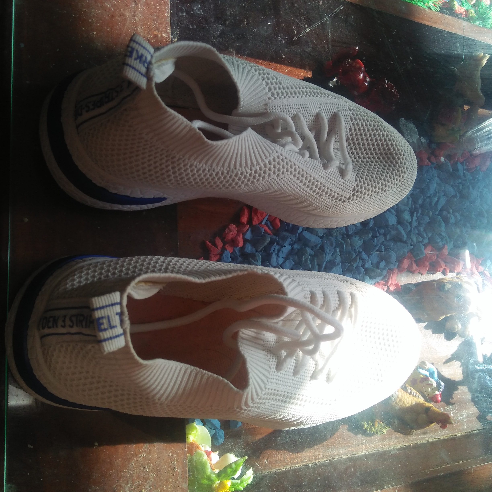
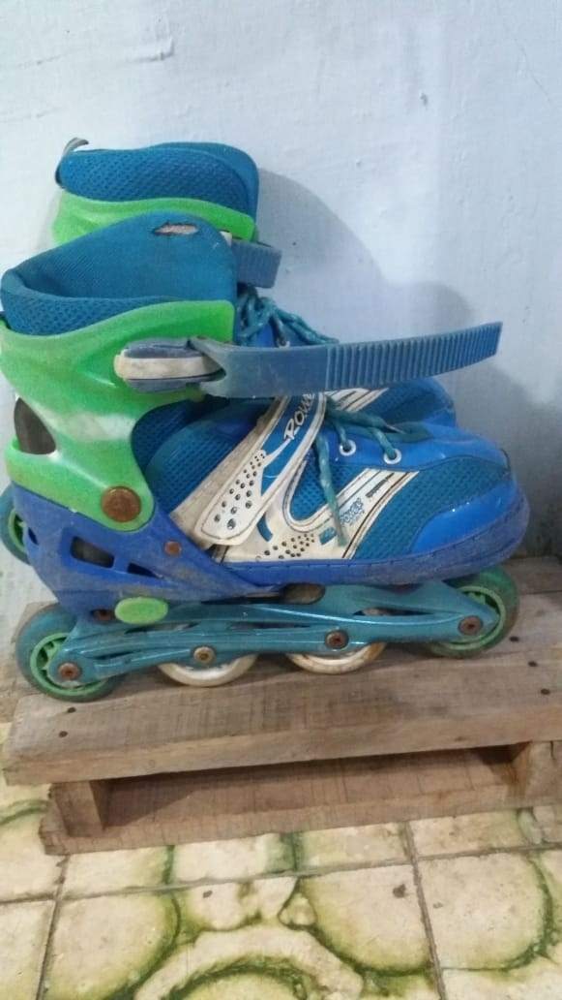

# Laporan Praktikum Pertemuan 1
## Output Program
Berdasarkan hasil pengamatan benda di sekitar saya, saya menemukan beberapa benda yang memiliki atribut dan juga behavior sehingga dapat dijadikan sebagai objek diantaranya yaitu sebagai berikut :

1. Sepatu

2. Sepatu Roda

3. Lemari

4. Rok

