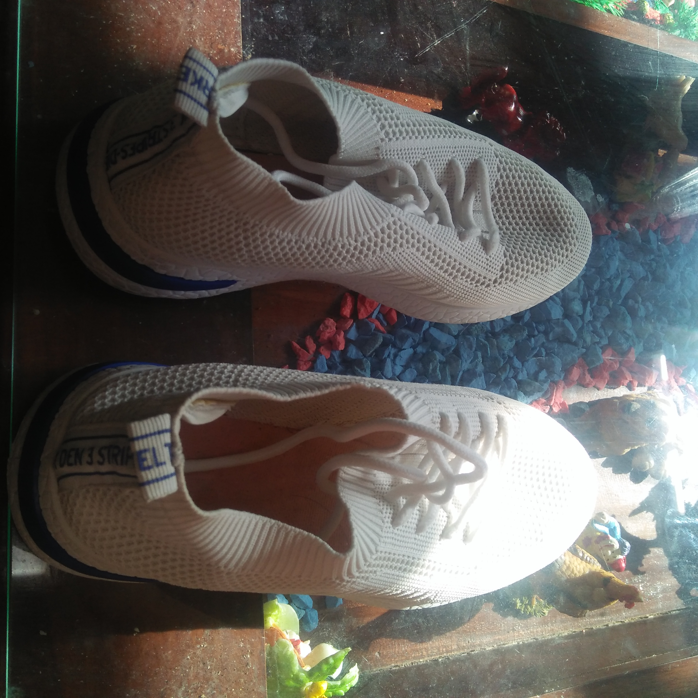
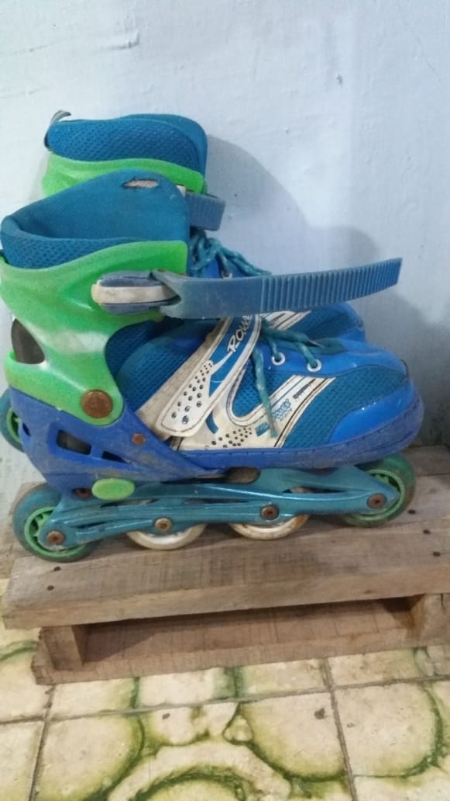
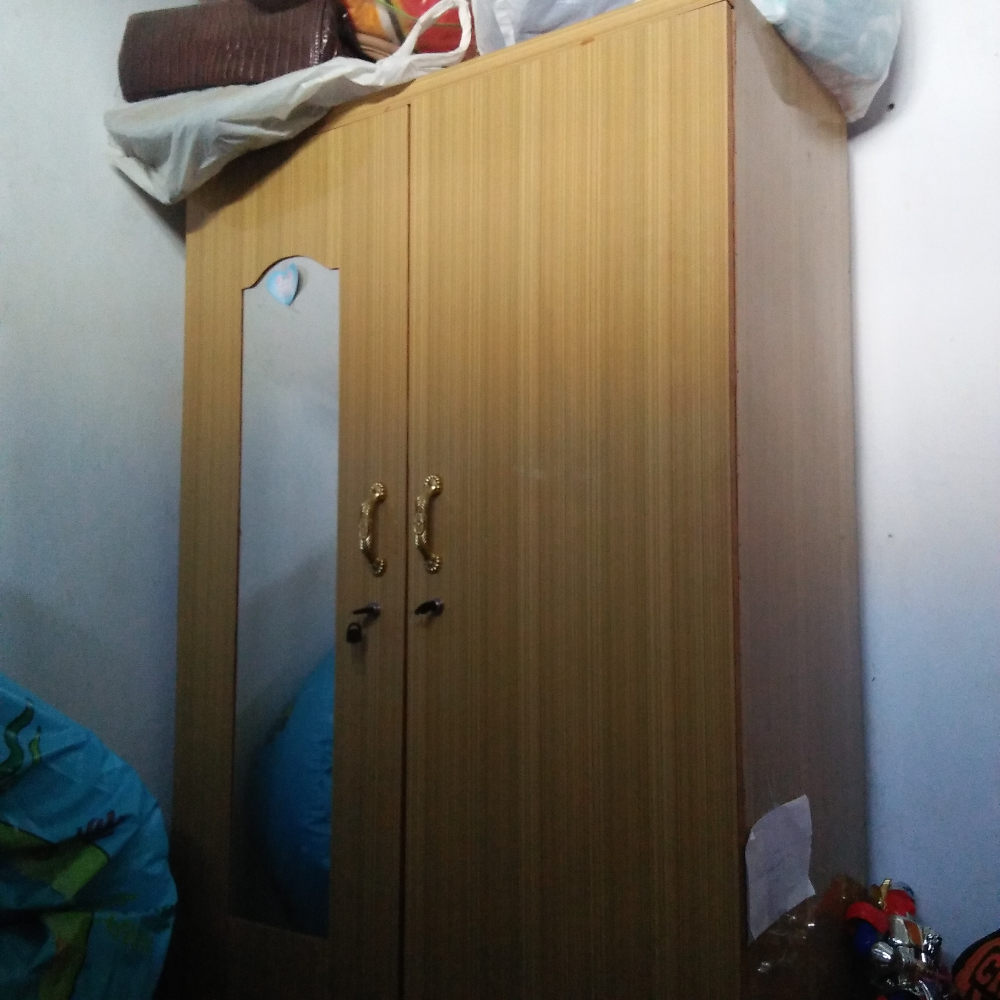
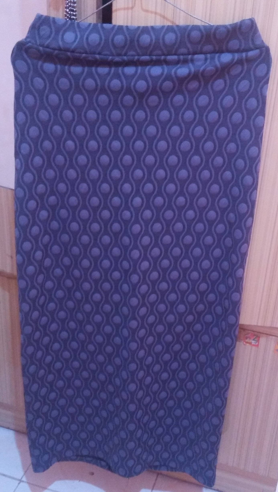

# Laporan Praktikum Pertemuan 1
## Output Program
Berdasarkan hasil pengamatan benda di sekitar saya, saya menemukan beberapa benda yang memiliki atribut dan juga behavior sehingga dapat dijadikan sebagai objek diantaranya yaitu sebagai berikut :

1. Sepatu
    

    [Kode Program Sepatu](../../src/TugasPraktikum/src/Praktikum/sepatu.java)

2. Sepatu Roda

    

    [Kode Program Sepatu Roda](../../src/TugasPraktikum/src/Praktikum/SepatuRoda.java)

3. Lemari
    

    [Kode Program Lemari](../../src/TugasPraktikum/src/Praktikum/lemari.java)

4. Rok
    

    [Kode Program Rok](../../src/TugasPraktikum/src/Praktikum/rok.java)

    [Kode Program Main](../../src/TugasPraktikum/src/Praktikum/Demo.java)
