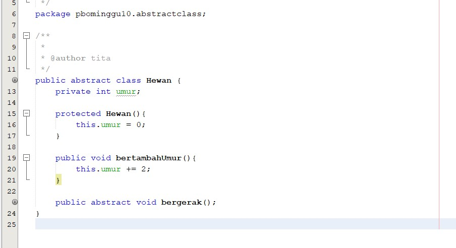
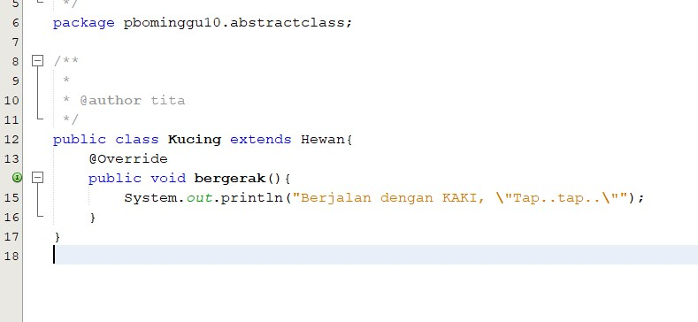
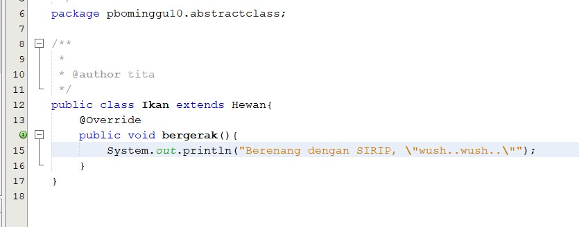
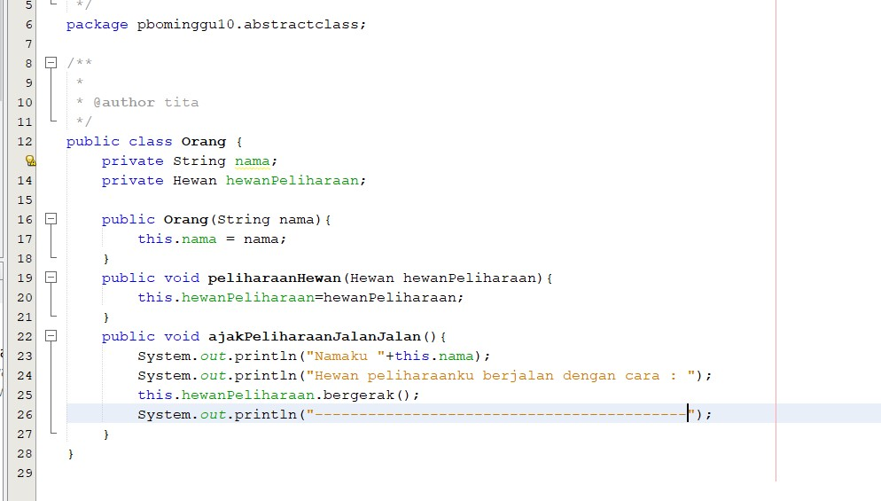
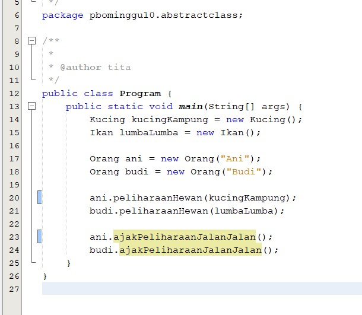
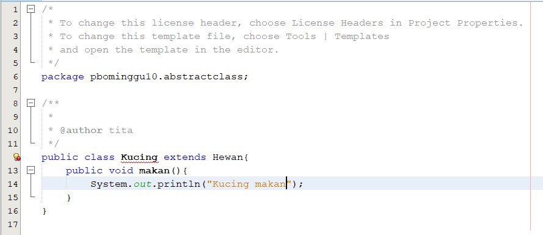
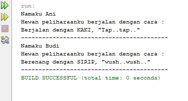
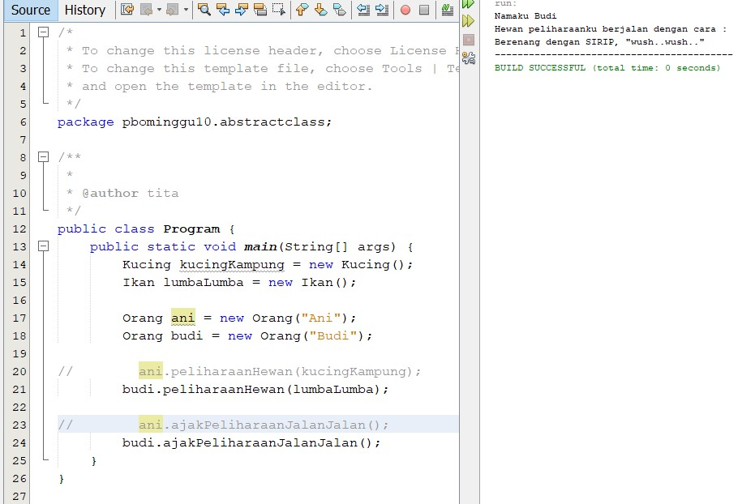

# Laporan Praktikum PBO Pertemuan 10

[Kode Program Class Hewan](../../src/PBOMinggu10/src/pbominggu10/abstractclass/Hewan.java)

[Kode Program Class Kucing](../../src/PBOMinggu10/src/pbominggu10/abstractclass/Kucing.java)

[Kode Program Class Ikan](../../src/PBOMinggu10/src/pbominggu10/abstractclass/Ikan.java)

[Kode Program Class Orang](../../src/PBOMinggu10/src/pbominggu10/abstractclass/Orang.java)

[Kode Program Class Program](../../src/PBOMinggu10/src/pbominggu10/abstractclass/Program.java)

## Pertanyaan
Pertanyaan diskusi:
Bolehkah apabila sebuah class yang meng-extend suatu abstract class tidak
mengimplementasikan method abstract yang ada di class induknya? Buktikan!
    
**Jawab :**
Tidak boleh. akan muncul pesan error "Kucing is not abstract and does not override abstract method bergerak() in Hewan"

1. Berikan penjelasan terkait tentang jalannya program diatas. 

    **Jawab :**

    Pada class abstract terdapat method yang diabstract dimana selanjutnya method ini akan lebih spesifik lagi pada kelas turunannya, class turunan harus meng-override method abstract pada induknya. Kemudian pada class Program kita menginstansiasi 4 objek yaitu kucingKampung, lumbaLumba, ani, budi. Yang dimana kucingKampung dan lumbaLumba sebagai nilai parameter pada method peliharaanHewan pada class Orang yang dimana akan digunakan untuk mengambil nilai pada masing-masing class turunannya. Dan kemudian kita mengakses dengan menggunakan 2 object dari class Orang untuk method ajakPeliharaanJalanJalan() untuk mencetak data yang telah di buat pada class Orang. Lebih singkatnya :
    
    1. Menginstansiasi class Kucing dengan membuat object kucingKampung
    2. Menginstansiasi class Ikan, dengan membuat object lumbaLumba
    3. Menginstansiasi class Orang, dengan membuat object ani dengan nilai konstruktor "Ani"
    4. Menginstansiasi class Orang dengan membuat object budi dengan nilai konstruktor "Budi"
    5. Mengakses method peliharaanHewan dengan object ani dan memberi nilai parameter yaitu kucingKampung
    6. Mengakses method peliharaanHewan dengan object budi dan memberi nilai parameter yaitu lumbaLumba
    7. Mengakses method ajakPeliharaanJalanJalan() yang dimana didalamnya terdapat perintah untuk mengeprint nama sesuai object yang telah dibuat, kemudian mengakses method bergerak() pada class Hewan yang kemudian akan menampilkan data spesifik class turunannya sesuai dengan parameter setiap object pada class Orang. Misal Ani menggunakan object kucingKampung maka data yang ditampilkan sesuai dengan class Kucing.

2. Tunjukkan hasil kompilasi program dan berikan penjelasan singkat jika method
bergerak() diubah menjadi method abstract!

    **Jawab :**

    

    Jika method diubah menjadi abstract maka setiap class turunannya harus meng-overide method tersebut dan dirubah menjadi lebih spesifik pada class masing-masing. Contohnya pada class Kucing dan Ikan yang sama-sama meng-extends class Hewan kemudian kedua class tersebut menggunakan method yang bertipe abstract pada class induknya namun isinya atau output yang ditampilkan berbeda karena masing-masing class mengeset isi sesuai dengan kebutuhan mereka tidak harus sama, inilah yang dikatakan bahwa method abstract dapat lebih spesifik lagi pada class turunannya.

3. Tunjukkan hasil kompilasi program dan berikan penjelasan singkat jika tidak dilakukan
overriding terhadap method bergerak()

    **Jawab :**

    Jika tidak dilakukan overriding method bergerak() pada class turunan terhadap class induk maka pada class tersebut akan muncul pesan error misal disini saya ambil contoh class Kucing lalu saya buat method sendiri tanpa override method bergerak() hasilnya akan seperti dibawah : 
    
    
    

    pesan errornya yaitu "Kucing is not abstract and does not override abstract method bergerak() in Hewan" mengapa demikian karena pada class induk method bergerak bertipe abstract namun apabila method bergerak() tidak bertipe abstract class turunan tidak akan error walaupun tidak meng-override method tersebut.

4. Tunjukkan hasil kompilasi program dan berikan penjelasan singkat jika abstract method
bergerak() yang dideklarasikan dalam Class Ikan

    **Jawab :**

    Berikut adalah hasilnya :

    

    Pada class ikan dideklarasikan method bergerak() yang dimana berisikan perintah untuk print kalimat "Berenang dengan SIRIP, wush..wush.." yang kemudian method ini akan diakses pada class Orang untuk ditampilkan saat program dieksekusi.