# Laporan Praktikum PBO Pertemuan 11 - Interface
## Percobaan 1
Yang harus dirubah agar tidak error yaitu menghapus kode program "pakrektor.beriSertifikatCumlaude(mhsBiasa);" agar output yang dihasilkan sama dengan langkah ke 10 

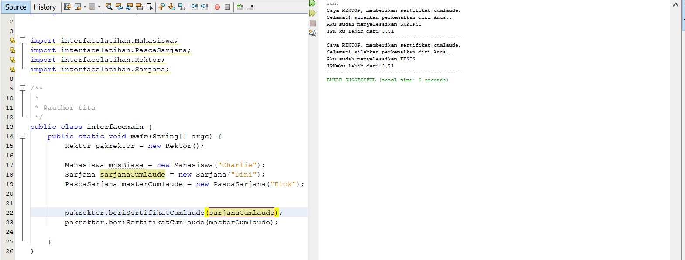

## Pertanyaan Percobaan 1
1. Pada langkah ke 9, pada baris program ke 3 terdapat warning pada script tersebut.
Jelaskan penyebab terjadinya hal tersebut ?

    **Jawab :**

    Terjadi karena class masih dalam 1 package sehingga tidak diperlukan import atau import tidak digunakan(unused import)

2. Pada langkah ke 9, pada baris program ke 3. Apa yang terjadi jika script tersebut
dihilangkan? Jelaskan menurut pemahaman anda.

    **Jawab :**

    Tidak ada yang error karena memang import tersebut unused atau tidak diperlukan karena semua class masih terdapat dalam 1 package yang sama yaitu interfacelatihan.

    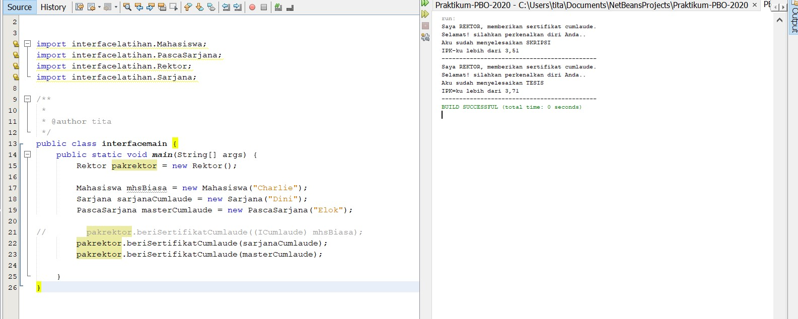

3. Mengapa pada langkah nomor 9 terjadi error? Jelaskan!

    **Jawab :**

    Pada langkah nomor 9 terdapat pesan "Mahasiswa cannot be converted to ICumlaude" karena pada class rektor method beriSertifikatCumlaude() berparameter tipe ICumlaude sedangkan pada class Mahasiswa tidak meng-implement interface ICumlaude sehingga terjadilah error.

4. Dapatkah method kuliahDiKampus() dipanggil dari objek sarjanaCumlaude di class
Program? Mengapa demikian?

    **Jawab :**

    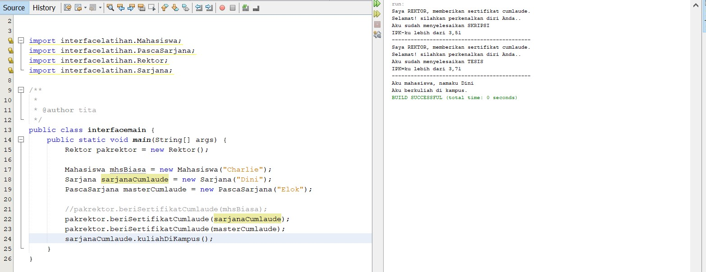

    Class Sarjana meng-extends class Mahasiswa yang dimana hal tersebut menjadikan class Sarjana sebagai subclass dari class Mahasiswa, sehingga objek sarjanaCumlaude yang berperan sebagai object dari class Sarjana dapat mengakses method pada class induk(super class) yaitu kuliahDiKampus().

5. Dapatkah method kuliahDiKampus() dipanggil dari parameter mahasiswa di method
beriSertifikatCumlaude() pada class Rektor? Mengapa demikian?

    **Jawab :**

    Tidak karena parameter beriSertifikatCumlaudae() bertipe ICumlaude sedangkan method kuliahDiKampus() berada pada class Mahasiswa. Namun apabila tipe ICumlaude dirubah menjadi Mahasiswa maka parameter mahasiswa dapat memanggil method kuliahDiKampus().

6.  Modifikasilah method beriSertifikatCumlaude() pada class Rektor agar hasil eksekusi
class Program menjadi seperti berikut ini: 

    **Jawab :**

    Kita tambahkan method kuliahDiKampus() didalam method lulus() pada class Sarjana seperti dibawah :

    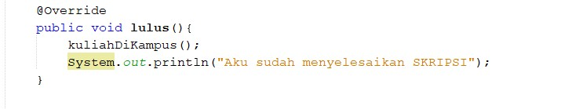

    dan class PascaSarjana seperti dibawah : 

    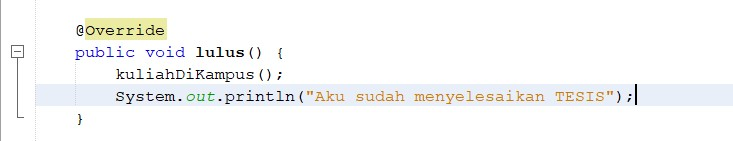

    Output : 

    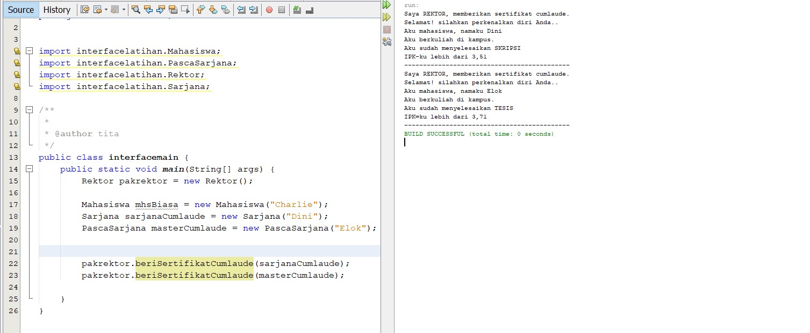

## Percobaan 2
Yang harus dirubah agar tidak error yaitu menghapus/meng-command kode program "pakrektor.beriSertifikatCumlaude(sarjanaCum);" agar output yang dihasilkan sama dengan langkah ke 6

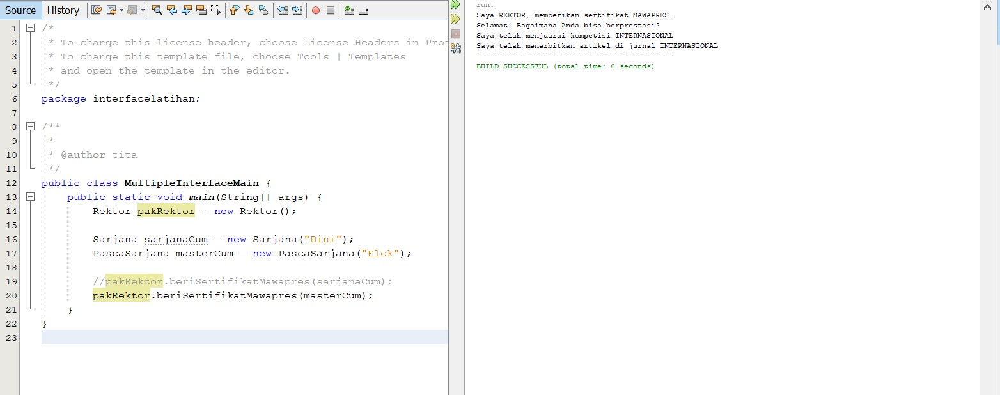

## Pertanyaan Percobaan 2
1. Pada script code interface IBerprestasi, modifikasi script tersebut sesuai dengan gambar
dibawah ini :

    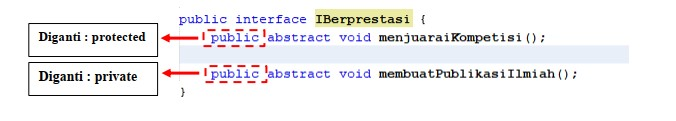

    Dari perubahan script diatas, apa yang terjadi ? serta jelaskan alasannya (capture hasilnya)

    **Jawab :**
    
    
    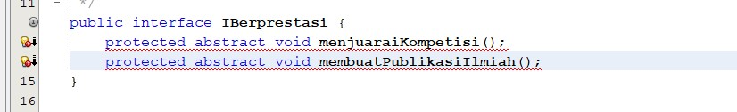

    Yang terjadi yaitu muncul pesan error "modifier protected not allowed here", hal ini terjadi karena pada method abstract yang diperbolehkan hanya modifier public sehingga apabila menggunakan modifier lain akan error.

2.  Perhatikan script code dibawah ini :

    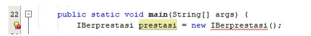

    **Jawab :**

    Hasil script tersebut error karena interface tidak dapat di instansiasi, tapi dapat di instansiasi melalui class yang meng-implement. Sedangkan pada gambar tersebut instansiasi dilakukan tidak melalui class yang meng-implement melainkan pada class main sehingga terjadi error.

3. Apabila Sarjana Berprestasi harus menjuarai kompetisi NASIONAL dan
menerbitkan artikel di jurnal NASIONAL, maka modifikasilah class-class yang terkait
pada aplikasi Anda agar di class Program objek pakRektor dapat memberikan sertifikat
mawapres pada objek sarjanaCumlaude.

    **Jawab :**

    Menambahkan implements IBerprestasi pada class Sarjana dan mengisi setiap method seperti dibawah :

    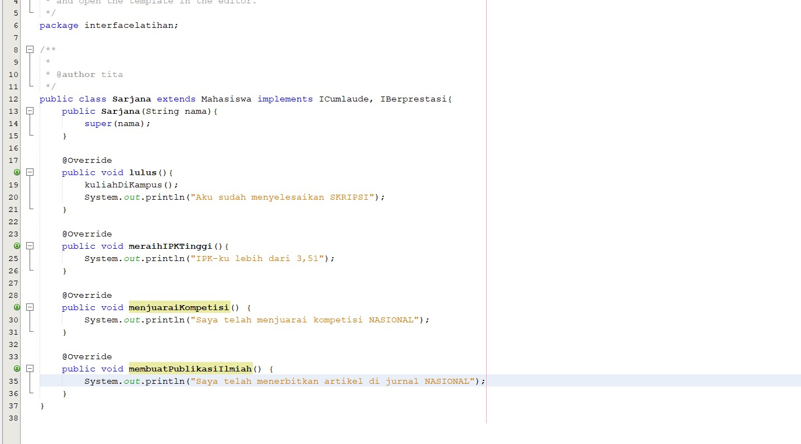

    output :

    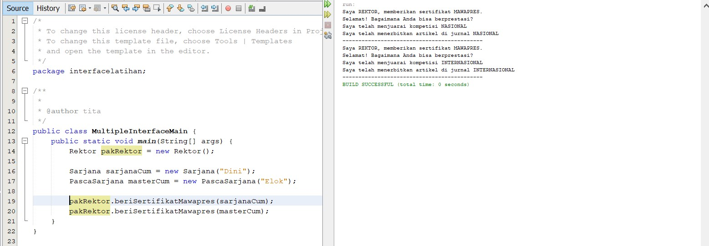