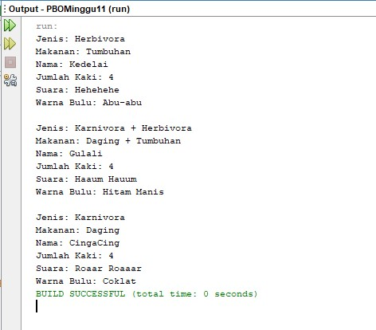

# Laporan Tugas Pratikum PBO - Pertemuan 11
Class Diagram 

[Kode Program Class Binatang](../../src/PBOMinggu11/src/tugas/Binatang.java)

[Kode Program Class Gorilla](../../src/PBOMinggu11/src/tugas/Gorilla.java)

[Kode Program Class Singa](../../src/PBOMinggu11/src/tugas/Singa.java)

[Kode Program Class Keledai](../../src/PBOMinggu11/src/tugas/Keledai.java)

[Kode Program Interface Karnivora](../../src/PBOMinggu11/src/tugas/IKarnivora.java)

[Kode Program Interface Karnivora](../../src/PBOMinggu11/src/tugas/IHerbivora.java)

[Kode Program Class Demo](../../src/PBOMinggu11/src/tugas/Demo.java)

Output : 

