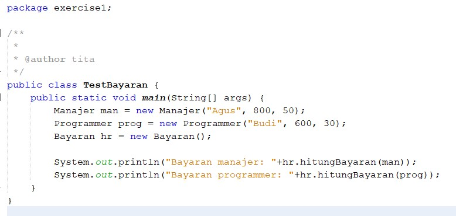

# Laporan Exercise Teori PBO - Pertemuan 12
## Exercise 1

[Kode Program Class Pegawai](../../src/PBOMinggu12(Teori)/src/exercise1/Pegawai.java)

[Kode Program Class Manajer](../../src/PBOMinggu12(Teori)/src/exercise1/Manajer.java)

[Kode Program Class Programmer](../../src/PBOMinggu12(Teori)/src/exercise1/Programmer.java)

[Kode Program Class Bayaran](../../src/PBOMinggu12(Teori)/src/exercise1/Bayaran.java)

[Kode Program Class TestBayaran](../../src/PBOMinggu12(Teori)/src/exercise1/TestBayaran.java)

Output :

## Exercise 2

[Kode Program Class Elektronik](../../src/PBOMinggu12(Teori)/src/exercise2/Elektronik.java)

[Kode Program Class TelevisiJadul](../../src/PBOMinggu12(Teori)/src/exercise2/TelevisiJadul.java)

[Kode Program Class TelevisiModern](../../src/PBOMinggu12(Teori)/src/exercise2/TelevisiModern.java)

[Kode Program Class Manusia](../../src/PBOMinggu12(Teori)/src/exercise2/Manusia.java)

[Kode Program Class TestElektronik](../../src/PBOMinggu12(Teori)/src/exercise2/Elektronik.java)

Output :

