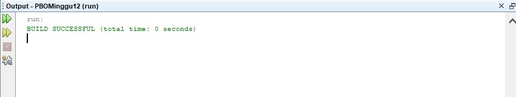
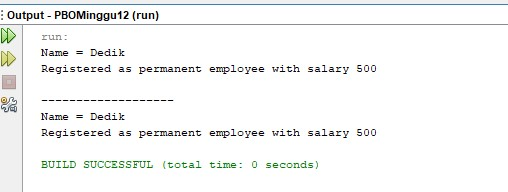
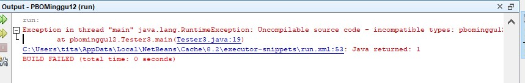
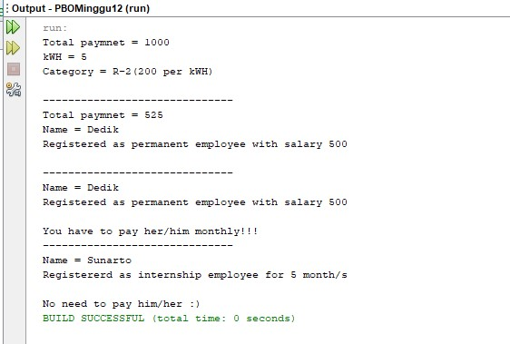

# Laporan Praktikum PBO - Pertemuan 12
## Percobaan 1

### Pertanyaan Percobaan 1
1. Class apa sajakah yang merupakan turunan dari class Employee?

    **Jawab :**

    Yang merupakan class turunan dari class Employee yaitu class InternShipEmployee dan class PermanentEmployee

2. Class apa sajakah yang implements ke interface Payable?

    **Jawab :**

    Class yang implements ke interface Payable adalah class PermanentEmployee dan class ElecticityBill

3. Perhatikan class Tester1, baris ke-10 dan 11. Mengapa e, bisa diisi
dengan objek pEmp (merupakan objek dari class PermanentEmployee)
dan objek iEmp (merupakan objek dari class
InternshipEmploye) ?

    **Jawab :**

    Ya karena objek pEmp dan iEmp merupakan class turunan dari objek e atau class Employee

4. Perhatikan class Tester1, baris ke-12 dan 13. Mengapa p, bisa diisi
dengan objek pEmp (merupakan objek dari class
PermanentEmployee) dan objek eBill (merupakan objek dari class
ElectricityBill) ?

    **Jawab :**

    Ya karena objek pEmp dan eBill merupakan implements ke interface Payable yang dimana dimana dibuat objek p sehingga p dapat diisi objek yang meng-implements.

5.  Coba tambahkan sintaks:

    p = iEmp;

    e = eBill;

    pada baris 14 dan 15 (baris terakhir dalam method main) ! Apa yang menyebabkan error?

    **Jawab :**

    Yang menyebabkan error yaitu objek iEmp tidak meng-implements interface Payable sehingga objek p yang merupakan objek dari interface Payable tidak bisa diisi dengan objek iEmp dari class InternshipEmployee dan objek eBill merupakan objek dari class ElectricityBill dan class tersebut bukan turunan dari class Employee sehingga objek e yang merupakan objek dari class Employee tidak dapat diisi dengan objek eBill.

6. Ambil kesimpulan tentang konsep/bentuk dasar polimorfisme!

    **Jawab :**

    Yang dapat saya simpulkan yaitu setiap class dapat memiliki method yang berbeda meskipun namanya sama.

## Percobaan 2

### Pertanyaan Percobaan 2
1. Perhatikan class Tester2 di atas, mengapa pemanggilan
e.getEmployeeInfo() pada baris 8 dan
pEmp.getEmployeeInfo() pada baris 10 menghasilkan hasil sama?

    **Jawab :**

    Karena objek e dari class Employee merupakan class induk dari class PermanentEmployee sehingga objek e dapat diisi dengan objek pEmp dari class PermanentEmployee oleh karena itu hasil yang ditampilkan sama.

2. Mengapa pemanggilan method e.getEmployeeInfo() disebut sebagai
pemanggilan method virtual (virtual method invication), sedangkan
pEmp.getEmployeeInfo() tidak?

    **Jawab :**

    Karena terjadi pemanggilan overriding method. Saat compile time, compiler akan mengenali method getEmployeeInfo() yang akan dipanggil adalah method getEmployeeInfo() yang ada di class Employee karena objek e bertipe Employee. Tetapi saat dijalankan, maka yang akan dijalankan oleh JVM adalah method getEmployeeInfo() yang ada pada class PermanentEmployee. Berbeda halnya apabila pemanggilan method getEmployeeInfo() dilakukan dari objek pEmp maka method getEmployeeInfo() yang dikenali saat compile time oleh compiler dan yang dijalankan saat runtime oleh JVM adalah sama-sama method getEmployeeInfo() yang ada pada class PermanentEmployee.

3. Jadi apakah yang dimaksud dari virtual method invocation? Mengapa
disebut virtual?

    **Jawab :** 

    Yang disebut virtual yaitu method yang dikenali oleh compiler dan method yang dijalankan oleh JVM berbeda.

## Percobaan 3

### Pertanyaan Percobaan 3
1. Perhatikan array e pada baris ke-8, mengapa ia bisa diisi dengan objek objek dengan tipe yang berbeda, yaitu objek pEmp (objek dari
PermanentEmployee) dan objek iEmp (objek dari
InternshipEmployee) ?

    **Jawab :**

    Karena objek tersebut merupakan objek dari class turunannya sehingga array dapat diisi dengan objek tersebut walaupun tipenya berbeda.

2. Perhatikan juga baris ke-9, mengapa array p juga bisa diisi dengan objek-objek
dengan tipe yang berbeda, yaitu objek pEmp (objek dari
PermanentEmployee) dan objek eBill (objek dari
ElectricityBilling) ?

    **Jawab :**

    Karena objek tersebut merupakan objek dari class yang meng-implement interface Payable sehingga objek dari interface Payable dapat diisikan dalam array p.

3. Perhatikan baris ke-10, mengapa terjadi error?

    **Jawab :**

    Karena objek eBill bukan turunan dari class Employee.

## Percobaan 4

### Pertanyaan Percobaan 4
1. Perhatikan class Tester4 baris ke-7 dan baris ke-11, mengapa
pemanggilan ow.pay(eBill) dan ow.pay(pEmp) bisa dilakukan,
padahal jika diperhatikan method pay() yang ada di dalam class Owner
memiliki argument/parameter bertipe Payable? Jika diperhatikan lebih detil eBill merupakan objek dari ElectricityBill dan pEmp merupakan objek dari PermanentEmployee?

    **Jawab :**

    Karena objek tersebut sama-sama meng-implement interface Payable sehingga dapat diakses seperti pada program tersebut.

2. Jadi apakah tujuan membuat argument bertipe Payable pada method
pay() yang ada di dalam class Owner?

    **Jawab :**

    Tujuannya agar dapat mengakses class yang meng-implements nya.

3. Coba pada baris terakhir method main() yang ada di dalam class
Tester4 ditambahkan perintah ow.pay(iEmp);
Mengapa terjadi error?

    **Jawab :**

    Eror karena parameter bertipe Payable sedangkan objek iEmp adalah sebuah objek dari class InternshipEmployee yang dimana class tersebut tidak mengi-implemets interface Payable.

4. Perhatikan class Owner, diperlukan untuk apakah sintaks p
instanceof ElectricityBill pada baris ke-6 ?

    **Jawab :**

    Diperlukan untuk mengecek apakah objek termasuk dalam objek yang dibuat dari class tersebut.

5. Perhatikan kembali class Owner baris ke-7, untuk apakah casting objek
disana (ElectricityBill eb = (ElectricityBill) p)
diperlukan ? Mengapa objek p yang bertipe Payable harus di-casting ke
dalam objek eb yang bertipe ElectricityBill ?

    **Jawab :**

    Karena agar objek bertipe Payable dirubah menjadi objek bertipe ElectricityBill sesuai dengan subclassnya. 