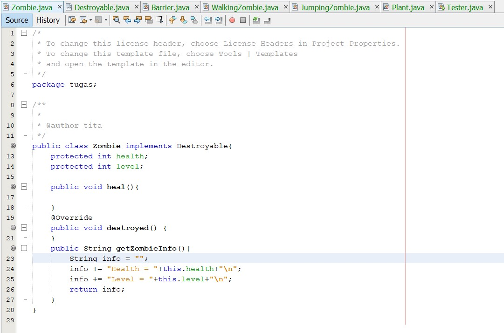
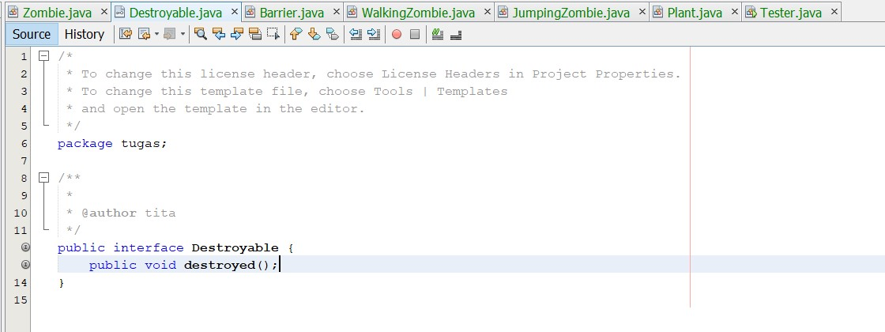
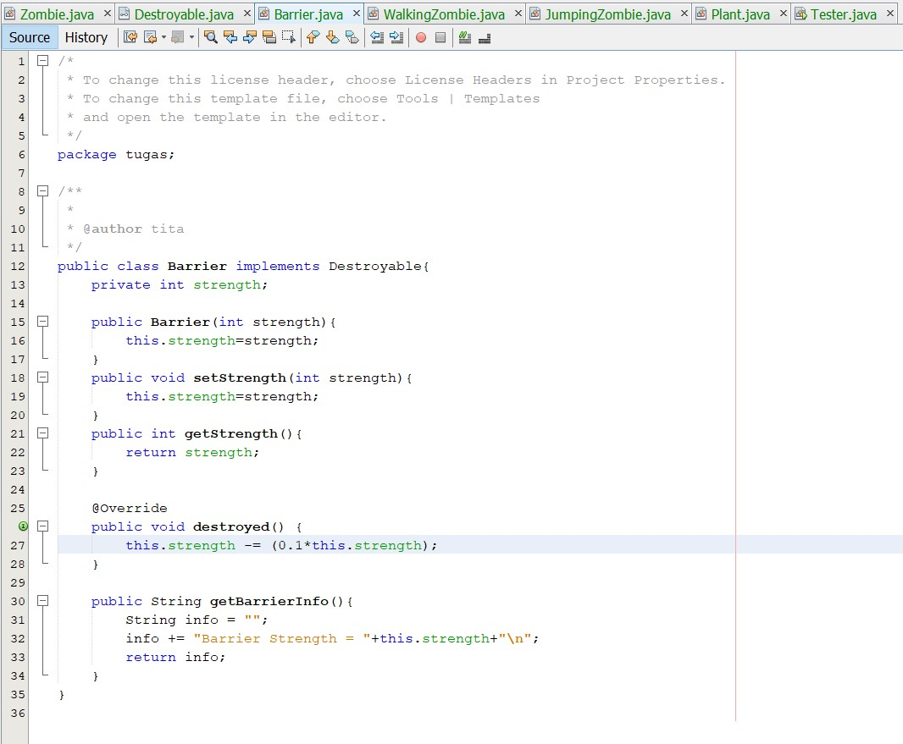
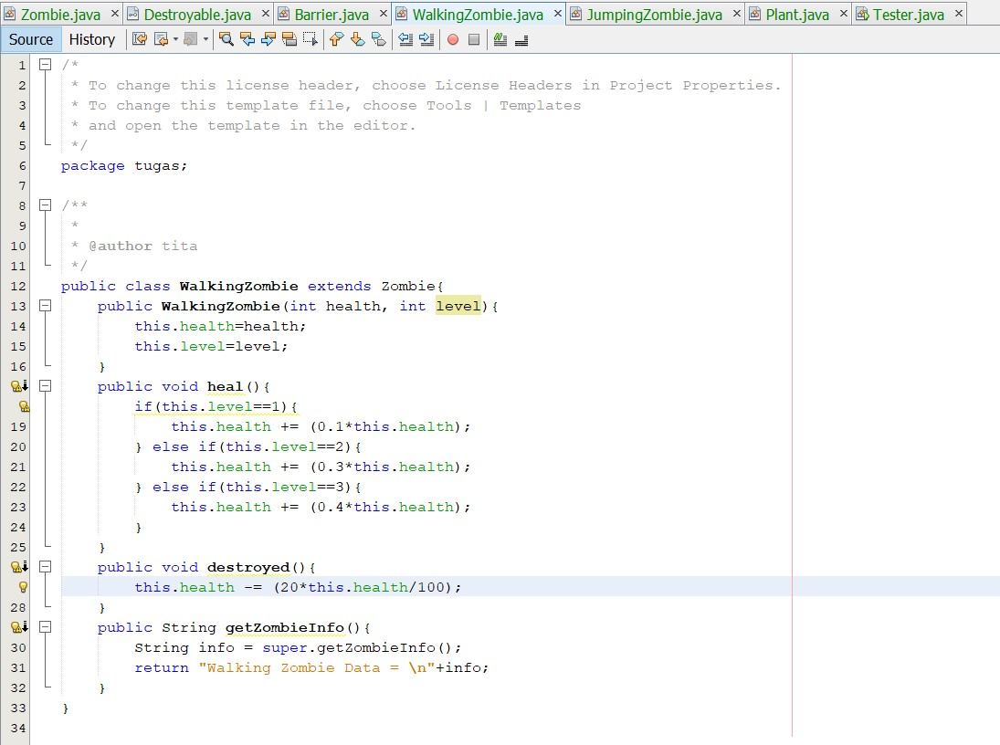
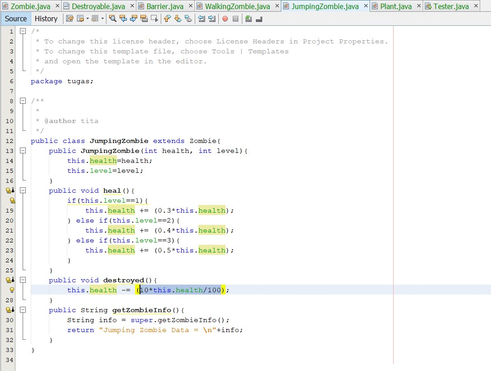
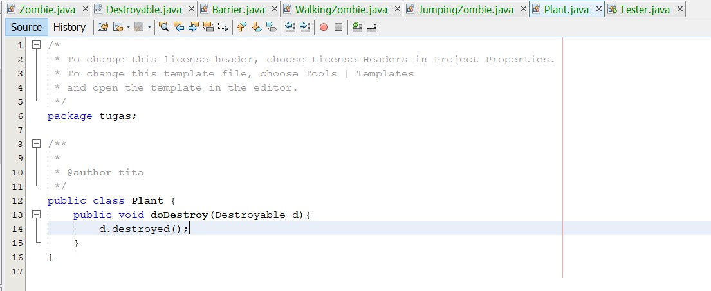
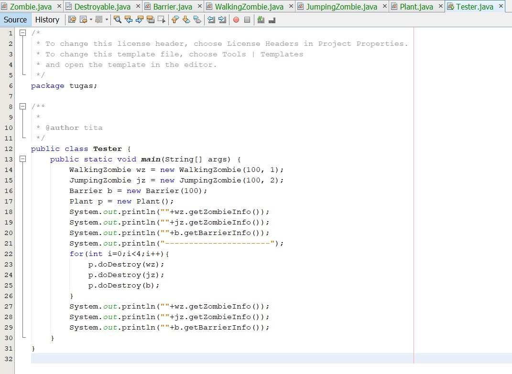
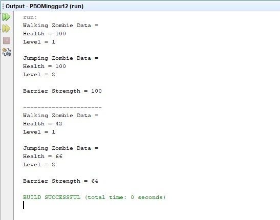

# Laporan Tugas Praktikum PBO - Pertemuan 12

[Kode Program Class Zombie](../../src/PBOMinggu12/src/tugas/Zombie.java)

[Kode Program Interface Destroyable](../../src/PBOMinggu12/src/tugas/Destroyable.java)

[Kode Program Class Barrier](../../src/PBOMinggu12/src/tugas/Barrier.java)

[Kode Program Class WalkingZombie](../../src/PBOMinggu12/src/tugas/WalkingZombie.java)

[Kode Program Class JumpingZombie](../../src/PBOMinggu12/src/tugas/JumpingZombie.java)

[Kode Program Class Plant](../../src/PBOMinggu12/src/tugas/Plant.java)

[Kode Program Class Tester](../../src/PBOMinggu12/src/tugas/Tester.java)

Output :

