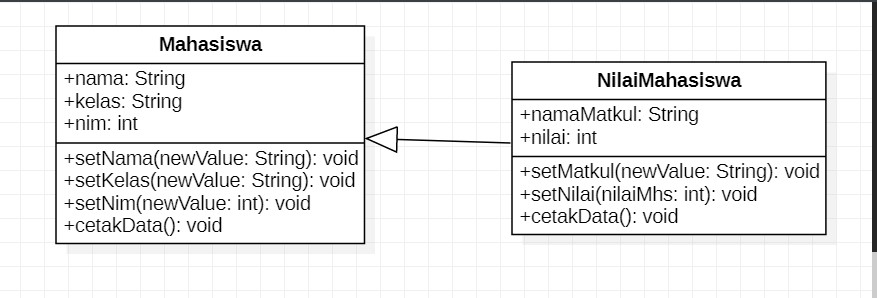
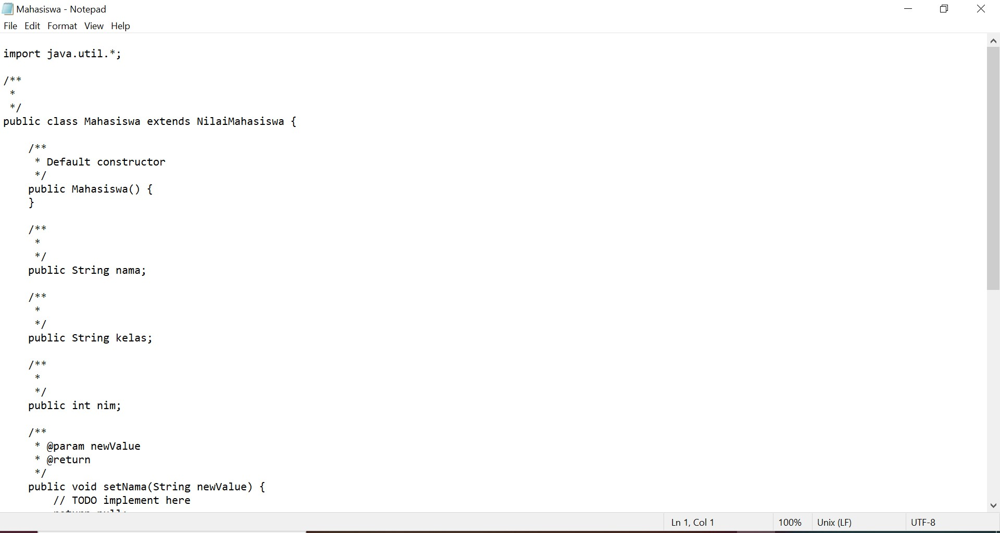
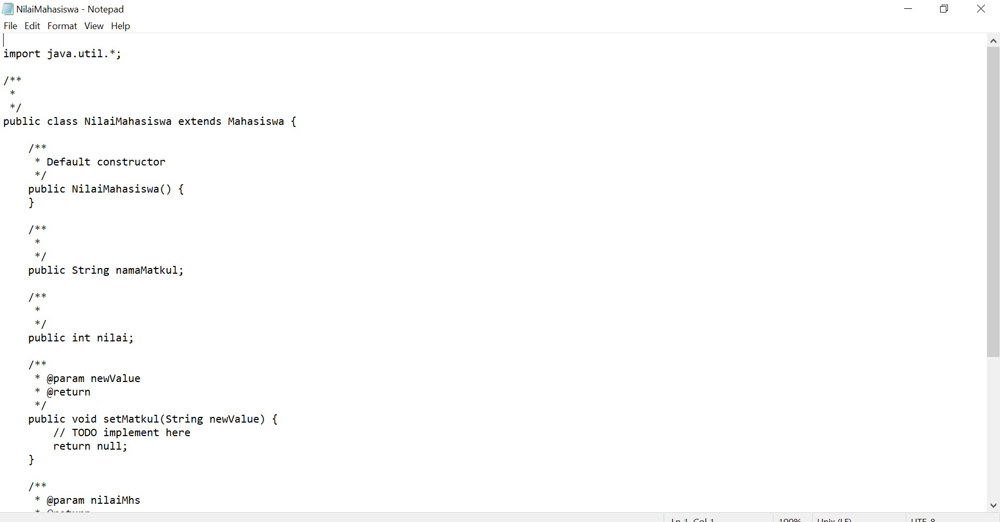
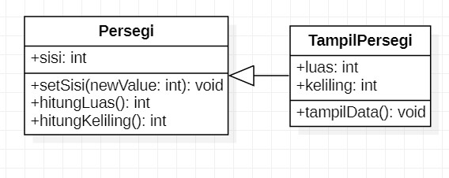
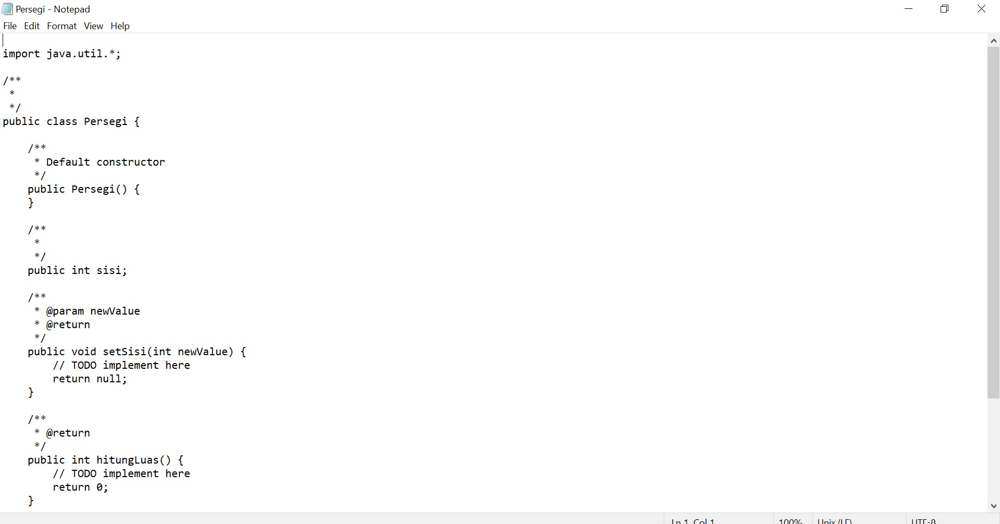
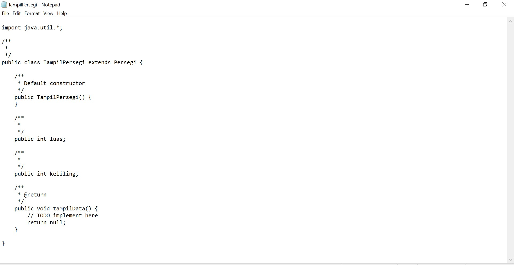

# Latihan Teori Pertemuan 2
## Soal Latihan
1. Jurusan Teknologi Informasi akan membangun system informasi pemberian nilai secara online kepada setiap mahasiswa yang menempuh perkuliahan. Setiap nilai mata
kuliah yang akan dimasukkan dalam system di inputkan
secara langsung oleh dosen yang bersangkutan. Dari
system ini diharapkan mahasiswa akan lebih mudah untuk
melakukan evaluasi terhadap setiap matakuliah yang sudah pernah diikuti.

    1) Identifikasi, ada berapa class yang bisa dibuat dari
sistem diatas ?

        **Jawab :**

        Menurut saya ada 2 class saja yaitu class yaitu Mahasiswa dan NilaiMahasiswa

    2) Implementasikan class dalam bahasa pemrograman java dan class diagram!

        **Jawab :**

        

        Source Code

        

        

2. Tambahkan secara lengkap attribute pada setiap class
yang sudah anda identifikasi pada latihan sebelumnya
(Latihan 1)?

    **Jawab :**

    

    

3. Buatlah implementasi dengan menggunakan class diagram dari soal berikut : 

    Class Persegi dengan atribut sisi dengan tipe data integer.
    
    Terdapat tiga method :
    - Method data persegi untuk menampilkan data panjang sisi dari persegi tersebut.
    - Method luas persegi untuk menghitung luas dari persegi tersebut dengan
rumus : sisi x sisi.
    - Method keliling persegi untuk menghitung keliling dengan rumus : 4 x sisi.

    **Jawab :**

    

    

    

