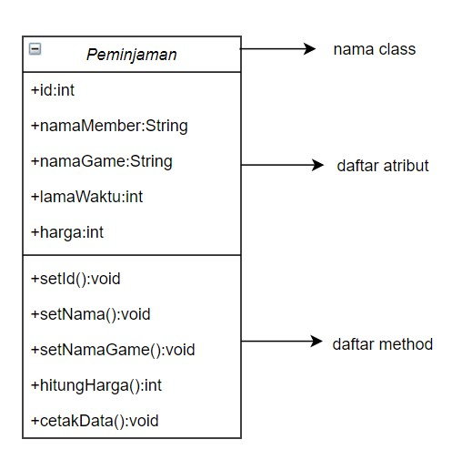
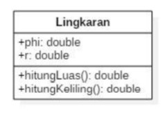
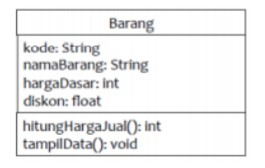

# Laporan Praktikum Pertemuan 2
## Tugas 
1. Suatu toko persewaan video game salah satu yang diolah adalah peminjaman, dimana
data yang dicatat ketika ada orang yang melakukan peminjaman adalah id, nama
member, nama game, dan harga yang harus dibayar. Setiap peminjaman bisa
menampilkan data hasil peminjaman dan harga yang harus dibayar. Buatlah class
diagram pada studi kasus diatas!
Penjelasan:
- Harga yang harus dibayar diperoleh dari lama sewa x harga.

- Diasumsikan 1x transaksi peminjaman game yang dipinjam hanya 1 game saja.

    **Jawab :**

    

2. Buatlah program dari class diagram yang sudah anda buat di no 1!

    **Jawab :**

    [Kode Program Class Diagram Peminjaman](../../src/Tugas2/src/Tugas/Peminjaman.java)

3. Buatlah program sesuai dengan class diagram berikut ini :

    

    **Jawab :** 

    [Kode Program Class Lingkaran](../../src/Tugas2/src/Tugas/Lingkaran.java)

4. Buatlah program sesuai dengan class diagram berikut ini :

    

    **Jawab :**
    
    [Kode Program Class Barang](../../src/Tugas2/src/Tugas/Barang.java)