# Laporan Tugas Pertemuan 3

## Tugas
1. Cobalah	program	dibawah	ini	dan	tuliskan	hasil	outputnya

    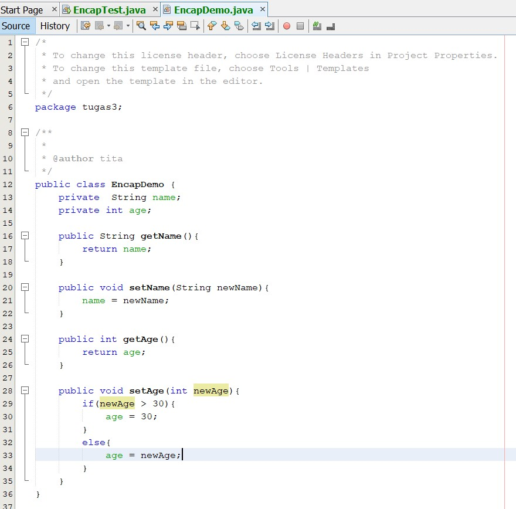

    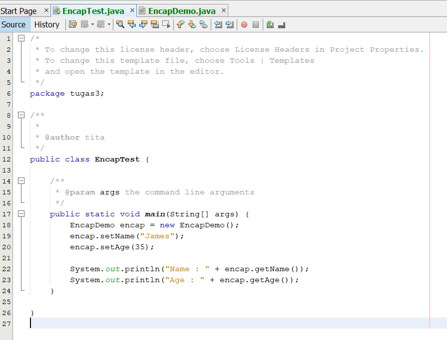

    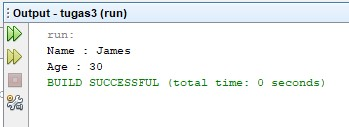

2. Pada	program	diatas,	pada	class	EncapTest	kita	mengeset	age	dengan	nilai	35,	namun	pada	
saat	ditampilkan	ke	layar	nilainya	30,	jelaskan	mengapa.

    **Jawab :**

    Karena pada class EncapDemo kita mengeset apabila newAge>30 maka dianggap age=30. Sehingga output yang ditampilkan 30 bukan 35.

3. Ubah	program	diatas	agar	atribut	age	dapat	diberi	nilai	maksimal	30	dan	minimal	18.

    **Jawab :**

    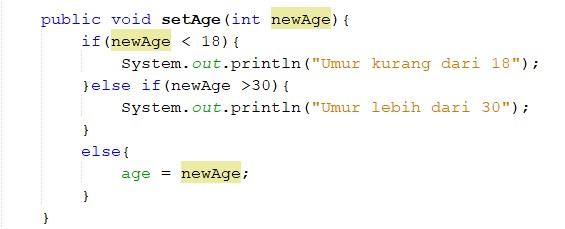

    [Kode Program Class Encap Demo](../../src/tugas3/src/tugas3/EncapDemo.java)

4. Pada	sebuah	sistem	informasi	koperasi	simpan	pinjam,	terdapat	class	Anggota	yang	memiliki	
atribut	antara	lain	nomor	KTP,	nama,	limit	peminjaman,	dan	jumlah	pinjaman.	Anggota	
dapat	meminjam	uang	dengan	batas	limit	peminjaman	yang	ditentukan.	Anggota	juga	dapat	
mengangsur	pinjaman.	Ketika	Anggota	tersebut	mengangsur	pinjaman,	maka	jumlah	
pinjaman	akan	berkurang	sesuai	dengan	nominal	yang	diangsur.	Buatlah	class	Anggota	
tersebut,	berikan	atribut,	method	dan	konstruktor	sesuai	dengan	kebutuhan.	Uji	dengan	
TestKoperasi	berikut	ini	untuk	memeriksa	apakah	class	Anggota	yang	anda	buat	telah	sesuai	
dengan	yang	diharapkan.

    **Jawab :**

    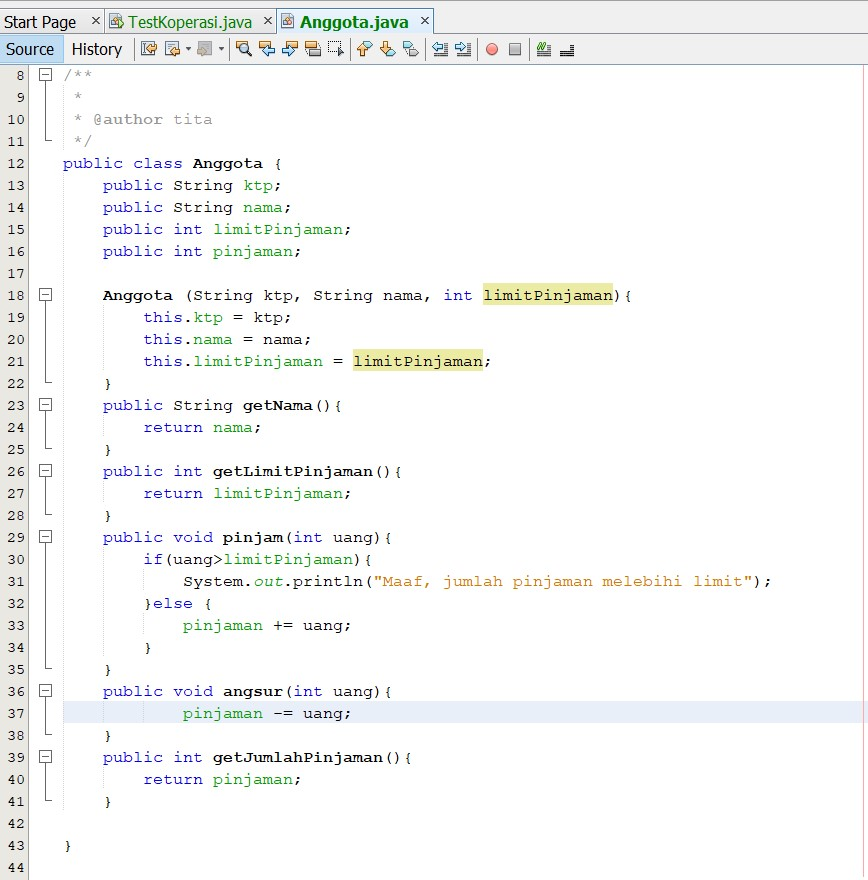

    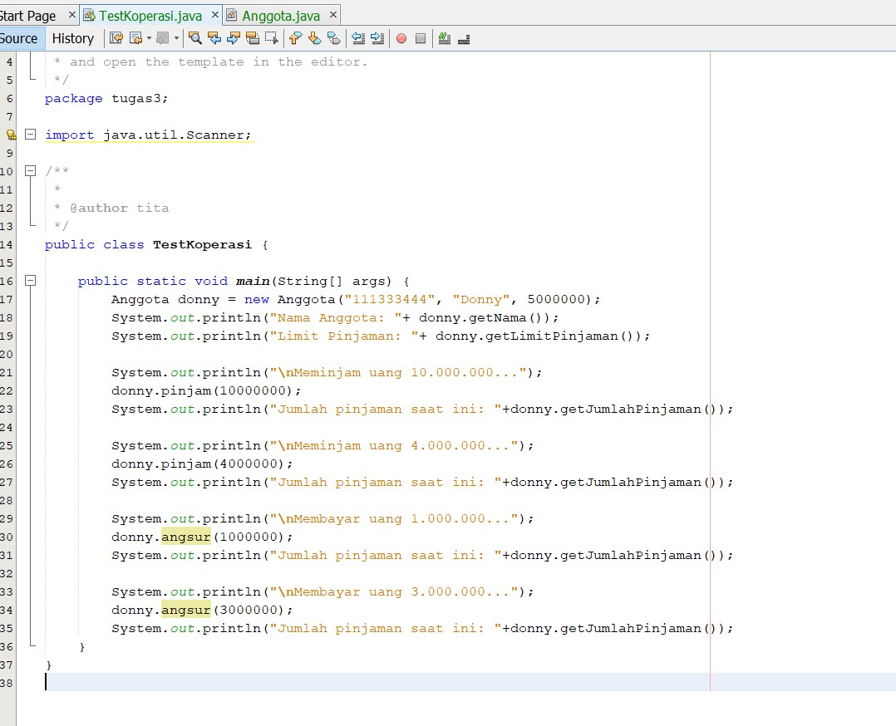

    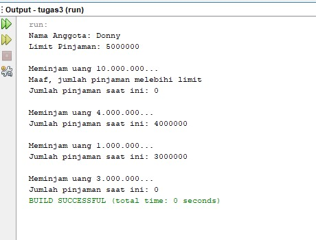

5. Modifikasi	soal	no.	4	agar	nominal	yang	dapat	diangsur	minimal	adalah	10%	dari	jumlah	
pinjaman	saat	ini.	Jika	mengangsur	kurang	dari	itu,	maka	muncul	peringatan	“Maaf,	
angsuran	harus	10%	dari	jumlah pinjaman”.

    **Jawab :**

    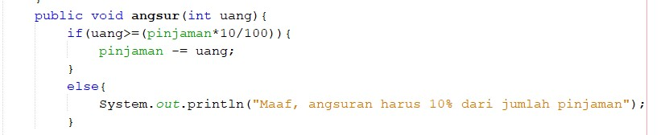

    [Kode Program Class Anggota](../../src/tugas3/src/tugas3/Anggota.java)

    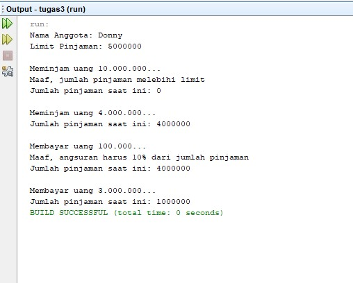

6. Modifikasi	class	TestKoperasi,	agar	jumlah	pinjaman	dan	angsuran	dapat	menerima	input	
dari	console.

    **Jawab :**

    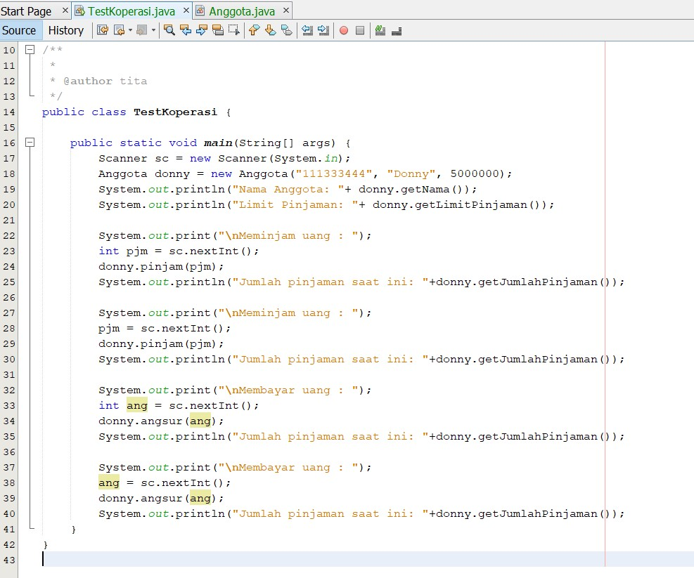

    [Kode Program Class Test Koperasi](../../src/tugas3/src/tugas3/TestKoperasi.java)

    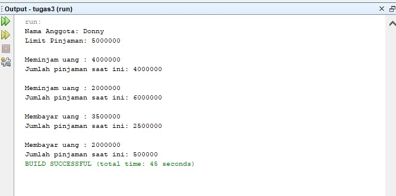

    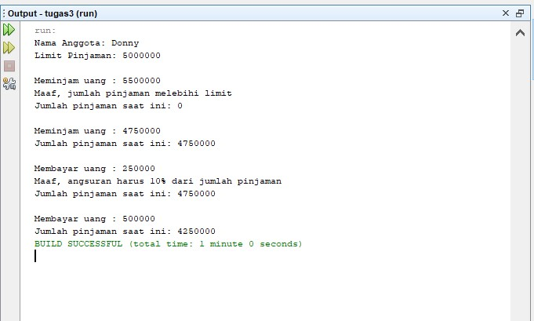