# Laporan Percobaan Pertemuan 3
## Percobaan 1 - Enkapsulasi

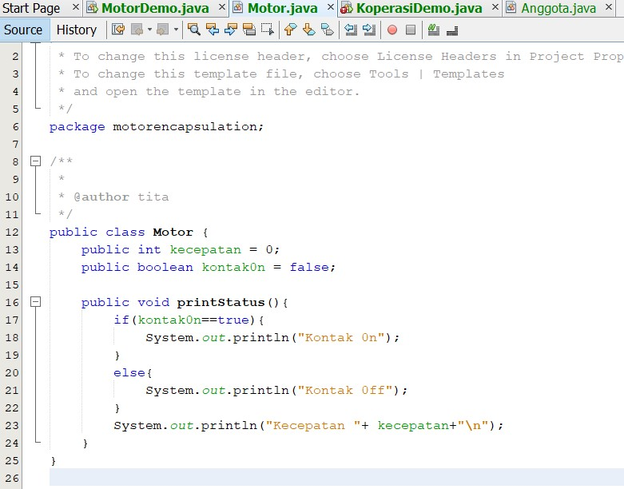

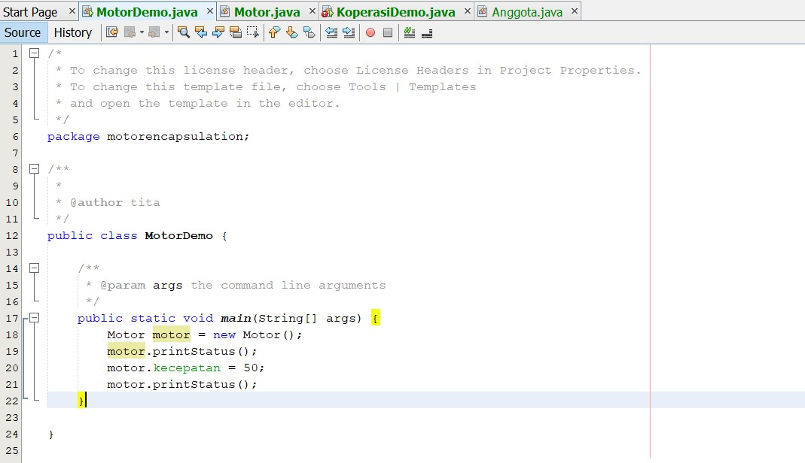

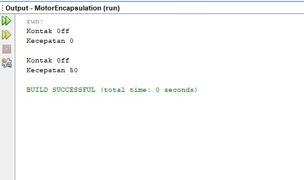

## Percobaan 2 - Access Modifier

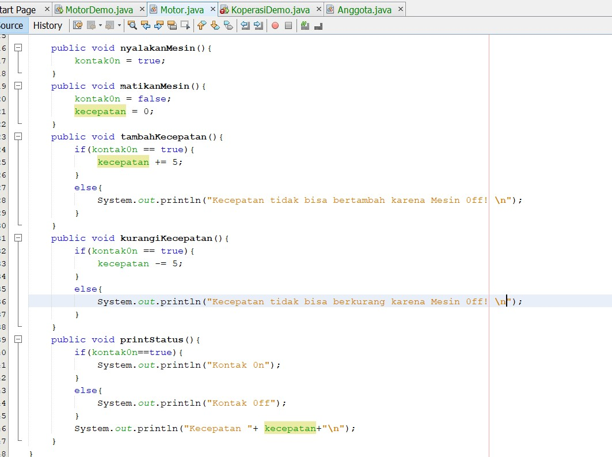

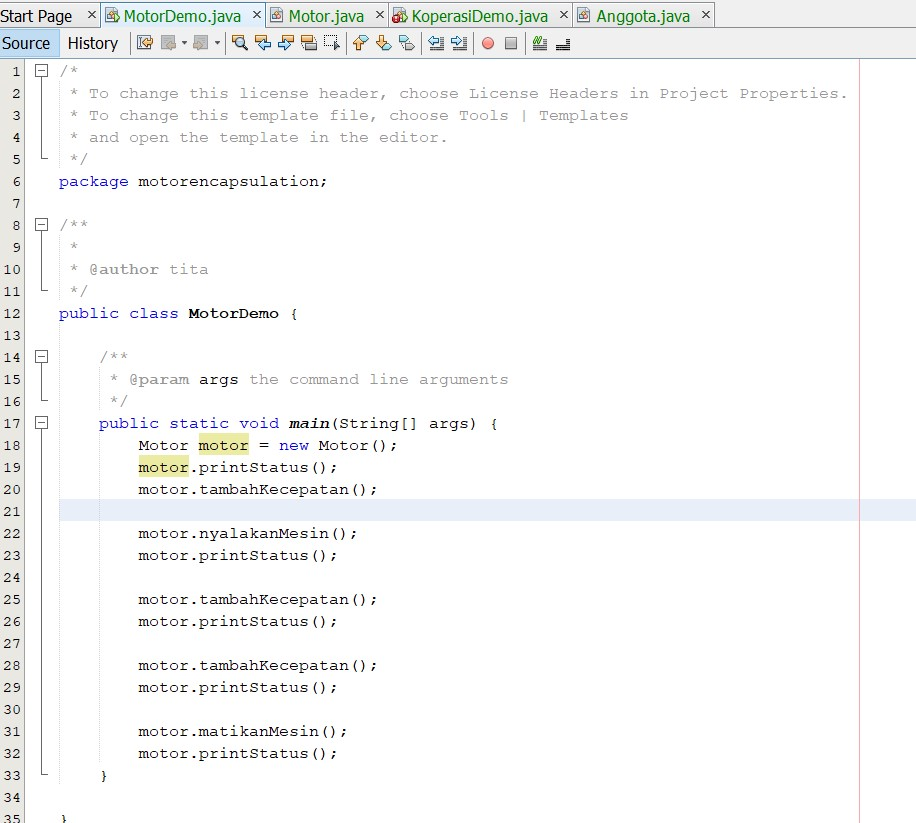

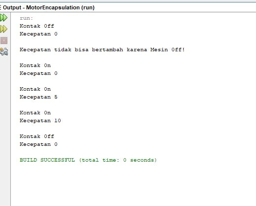

### Pertanyaan
1. Pada	 class	 TestMobil,	 saat	 kita	 menambah	 kecepatan	 untuk	 pertama	 kalinya,	 mengapa	
muncul	peringatan	“Kecepatan tidak bisa bertambah karena Mesin Off!”?	

    **Jawab :**

    Karena nilai kontak masih false

2. Mengapat	atribut	kecepatan	dan	kontakOn	diset	private?

    **Jawab :**

    Agar class lain meskipun dalam package yang sama tidak dapat mengakses atribut kecepatan dan kontakOn secara langsung

3. Ubah	class	Motor	sehingga	kecepatan	maksimalnya	adalah	100!

    **Jawab :**

    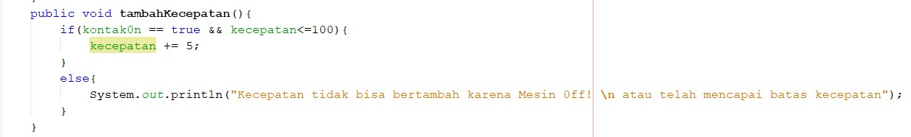

        

    [Kode Program Class Motor](../../src/MotorEncapsulation/src/motorencapsulation/Motor.java)

    [Kode Program Class Motor Demo](../../src/MotorEncapsulation/src/motorencapsulation/MotorDemo.java)

## Percobaan 3 - Getter dan Setter

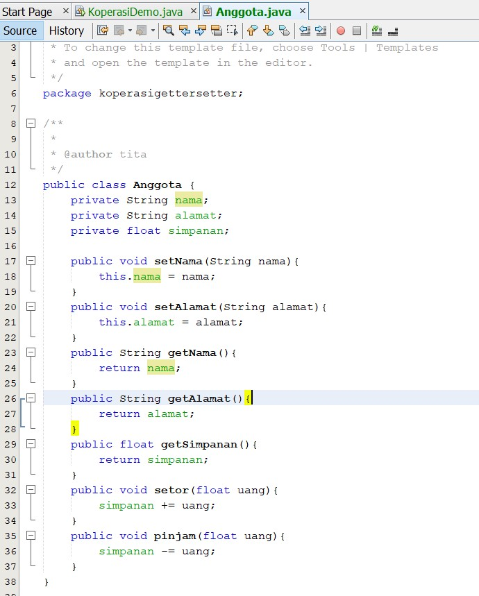

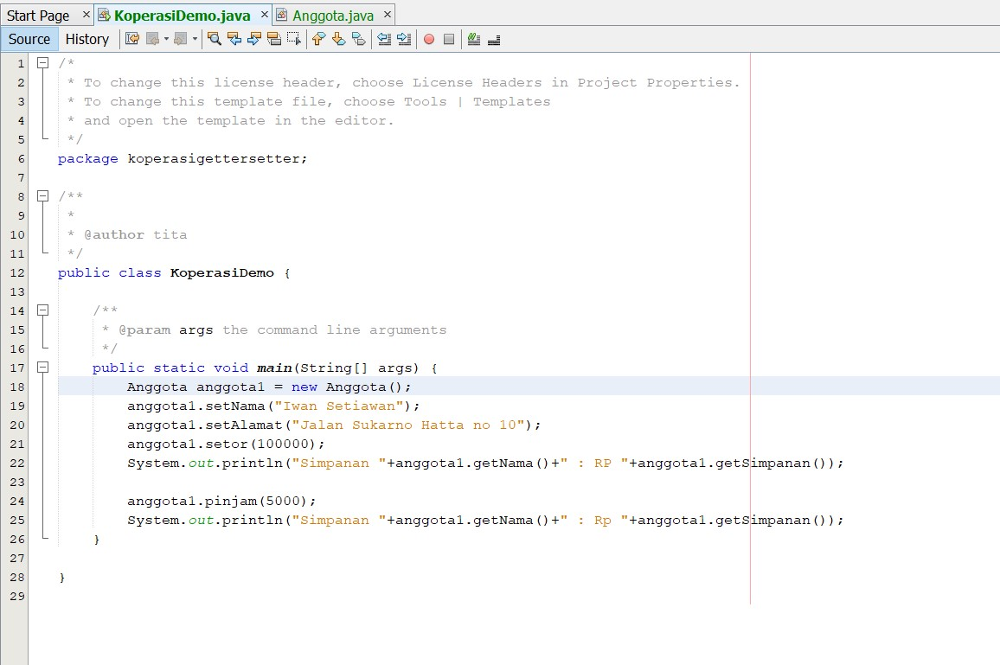

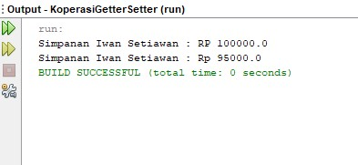

## Percobaan 4 - Konstruktor, Instansiasi

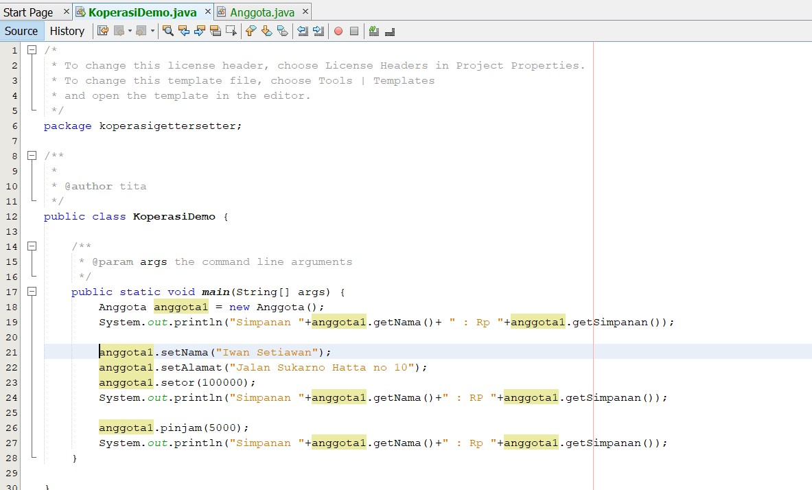

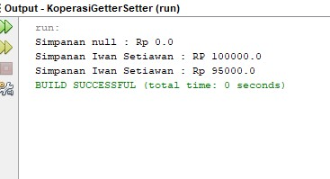

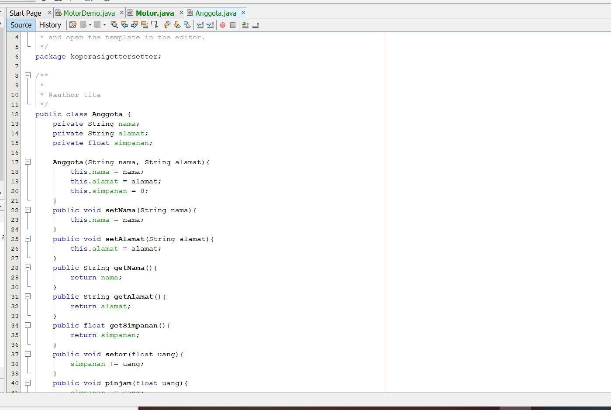

[Kode Program Class Anggota](../../src/KoperasiGetterSetter/src/koperasigettersetter/Anggota.java)

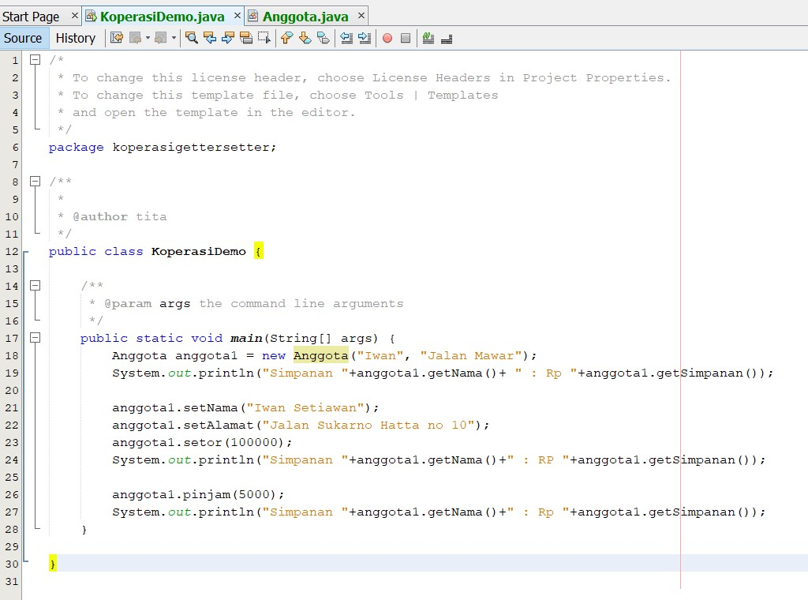

[Kode Program Class Koperasi Demo](../../src/KoperasiGetterSetter/src/koperasigettersetter/KoperasiDemo.java)

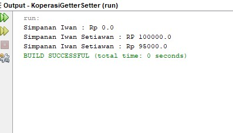

### Pertanyaan - Percobaan 3 dan 4
1. Apa	yang	dimaksud	getter	dan	setter?

    **Jawab :**

    Getter dan Setter adalah method untuk mengubah nilai dari atribut, sehingga nilai
dari atribut ini tidak dapat diubah secara langsung (atribut private), melainkan harus
menggunakan Getter dan Setter yang nama methodnya telah ditentukan dan dapat dipanggil
dari class lain.
2. Apa	kegunaan	dari	method	getSimpanan()?

    **Jawab :**

    Kegunaan dari method getSimpanan() adalah mengetahui nilai dari atribut simpanan
yang terdapat pada class Anggota.
3. Method	apa	yang	digunakan	untk	menambah	saldo?

    **Jawab :**

    Untuk menambah saldo dapat digunakan method setor().

4. Apa	yand	dimaksud	konstruktor?

    **Jawab :**

    Method istimewa yang digunakan saat pembuatan objek (instansiasi). Konstruktor sendiri dibagi menjadi 2 jenis yaitu konstruktor default dan konstruktor berparameter.

5. Sebutkan	aturan	dalam	membuat	konstruktor?

    **Jawab :**

    Aturan membuat konstruktor : 
    - Nama	konstruktor	harus	sama	dengan	nama	class
    - Konstruktor	tidak	memiliki	tipe	data	return
    - Konstruktor	tidak	boleh menggunakan	modifier abstract,	static,	final,	dan	syncronized
    - Di	java	kita	dapat	memiliki	konstruktor	dengan	modifier	private,	protected,	public	or	default.

6. Apakah	boleh	konstruktor	bertipe	private?

    **Jawab :**

    Ya, konstruktor dapat bertipe private. Namun, konstruktor ini hanya akan dapat diakses melalui class yang sama saja dengan class tempat konstruktor berada, sehingga instansiasi objek hanya dapat dilakukan di class yang sama dan objek tidak dapat lebih dari satu buah. Namun, umumnya konstruktor bersifat publik, agar kita dapat mengaksesnya dari luar dan menginstansiasi objek lebih dari satu.

7. Kapan	menggunakan	parameter	dengan	passsing	parameter?

    **Jawab :**

    Kita menggunakan parameter ketika menggunakan method yang digunakan untuk mengubah nilai atribut yang sudah memiliki nilai terlebih dahulu. Sedangkan passing parameter digunakan untuk melakukan instansiasi objek pada konstruktor.

8. Apa	perbedaan	atribut	class	dan	instansiasi	atribut?

    **Jawab :**

    Atribut class adalah atribut yang terdapat pada suatu class, sedangkan instansiasi atribut adalah metode untuk membuat atribut pada suatu class.

9. Apa	perbedaan	class	method	dan	instansiasi	method?	

    **Jawab :**

    Class method adalah method yang terdapat pada suatu class, sedangkan instansiasi method adalah metode untuk membuat sebuah method pada suatu class.
