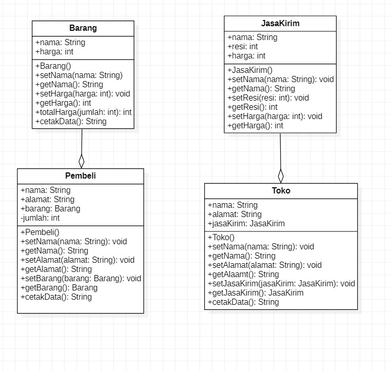
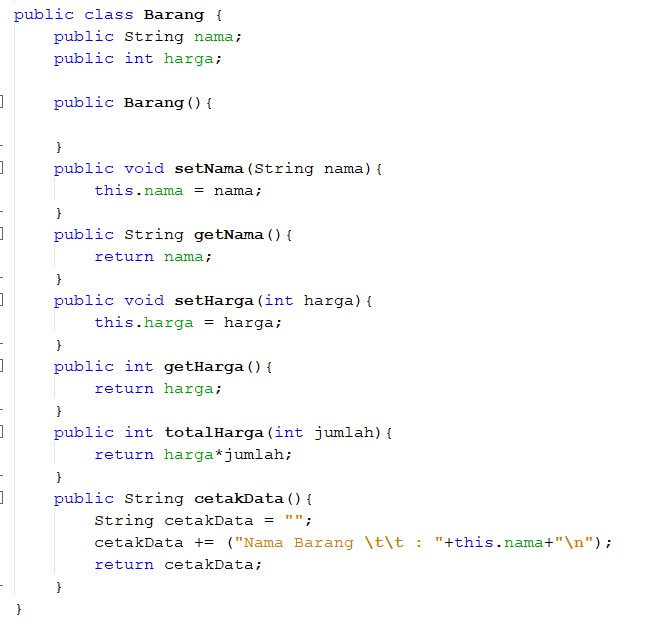
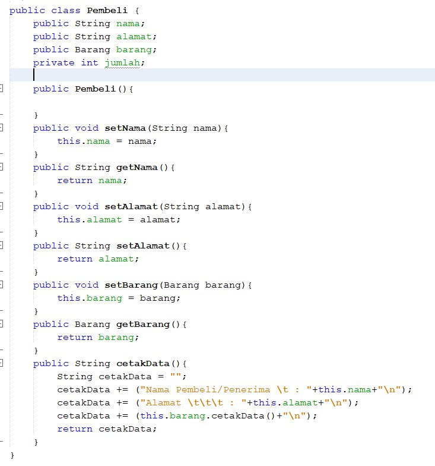
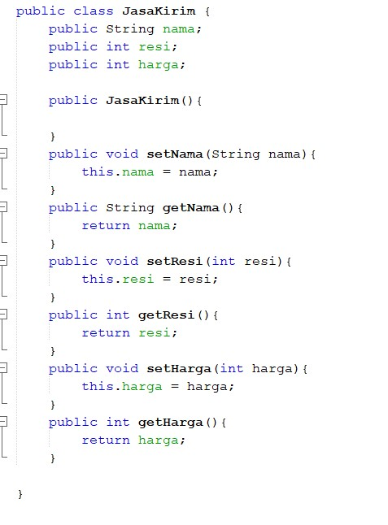
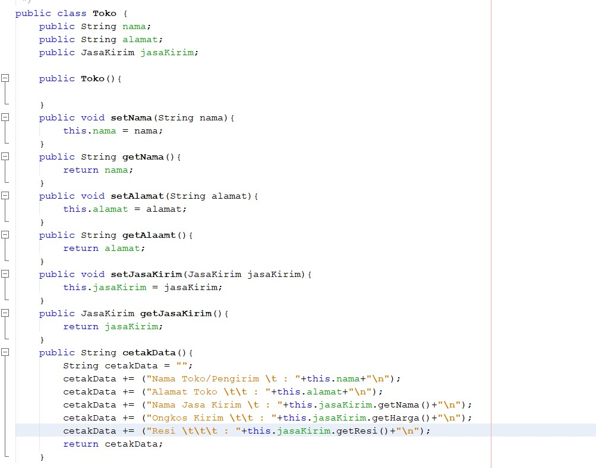
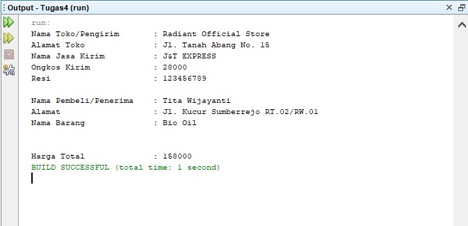

# Laporan Tugas Pertemuan 4

## Tugas 
Buatlah sebuah studi kasus, rancang dengan class diagram, kemudian implementasikan ke dalam
program! Studi kasus harus mewakili relasi class dari percobaan‑percobaan yang telah dilakukan
pada materi ini, setidaknya melibatkan minimal 4 class (class yang berisi main tidak dihitung).

Jawab :

Disini saya menggunakan tema online shop dimana class yang dibutuhkan yaitu pengirim, barang, jasa kirim(kurir), dan penerima. 

[Kode Program Class Barang](../../src/Tugas4/src/tugas4/Barang.java)

[Kode Program Class Pembeli](../../src/Tugas4/src/tugas4/Pembeli.java)

[Kode Program Class JasaKirim](../../src/Tugas4/src/tugas4/JasaKirim.java)

[Kode Program Class Toko](../../src/Tugas4/src/tugas4/Toko.java)

[Kode Program Class Main](../../src/Tugas4/src/tugas4/Main.java)

Output : 

