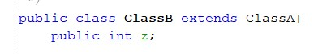
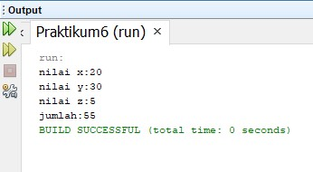
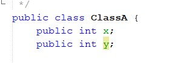
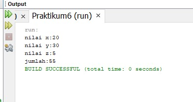
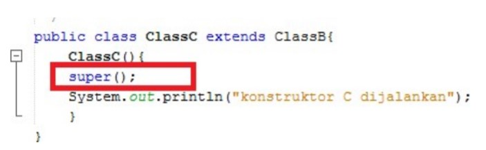
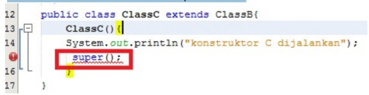
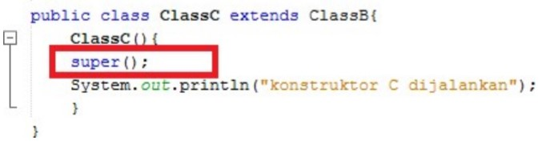

# Laporan Percobaan Praktikum 6
## Percobaan 1 (Extends)
### Pertanyaan
1. Pada percobaan 1 diatas program yang dijalankan terjadi error, kemudian perbaiki sehingga
program tersebut bisa dijalankan dan tidak error!

    **Jawab :**

    

    Output :

    

2. Jelaskan apa penyebab program pada percobaan 1 ketika dijalankan terdapat error!

    **Jawab :**

    Penyebab terjadi error karena pada ClassB belum di extends ke ClassA. Terutama pada fungsi getJumlah() yang dimana membutuhkan nilai x dan y dari ClassA. Sehingga perlu di extends terlebih dahulu agar atribut dapat diakses atau agar dapat mengambil nilai.

## Percobaan 2(Hak Akses)
### Pertanyaan
1. Pada percobaan 2 diatas program yang dijalankan terjadi error, kemudian perbaiki sehingga
program tersebut bisa dijalankan dan tidak error!

    **Jawab :**

    

    Output :

    

2. Jelaskan apa penyebab program pada percobaan 1 ketika dijalankan terdapat error!

    **Jawab :**

    Penyebab terjadinya error karena pada ClassA yang dimana sebagai super class pada saat pendeklarasian variabel menggunakan access modifies private sehingga tidak dapat diakses oleh ClassB sebagai sub classnya. Dan juga menambahkan extends pada ClassB agar dapat mengakses ke ClassA.

## Percobaan 3 (Super)
### Pertanyaan
1. Jelaskan fungsi “super” pada potongan program berikut di class Tabung!

    **Jawab :**

    fungsi super tersebut merujuk ke kelas parent sehingga kita dapat mengambil variable dari parent. Atau untuk mengakses atribut phi dan r yang telah dideklarasikan pada class Bangun sehingga pada class Tabung tidak perlu mendeklarasikan atribut tersebut.

2. Jelaskan fungsi “super” dan “this” pada potongan program berikut di class Tabung!

    **Jawab :**
    fungsi super digunakan untuk mengambil data nilai atribut pada parent sehingga tidak perlu dideklarasikan Kembali pada class turunan, sedangkan this adalah fungsi untuk mengambil nilai dari class yang sama atau berada dalam kelas tersebut saja.

3. Jelaskan mengapa pada class Tabung tidak dideklarasikan atribut “phi” dan “r” tetapi class
tersebut dapat mengakses atribut tersebut!

    **Jawab :**

    Karena pada class Tabung kita extends ke class Bangun yang telah mendeklarasikan atribut phi dan r sehingga pada class Tabung dapat mengakses atribut pada class Bangun dengan menggunakan fungsi super

## Percobaan 4 (Super Constructor)
### Pertanyaan
1. Pada percobaan 4 sebutkan mana class yang termasuk superclass dan subclass, kemudian
jelaskan alasannya!

    **Jawab :**

    Pada percobaan 4 yang menjadi sub class adalah ClassB dan ClassC, super classnya adalah ClassA. Lebih rincinya yaitu ClassB adalah subclass dari ClassA dan super class dari ClassC, ClassA adalah super class dari ClassB, dan ClassC adalah subclass dari ClassB. Mengapa demikian karena pada saat pendeklarasian class diikuti dengan kata extends yang dimana artinya adalah sebuah class turunan.

2. Ubahlah isi konstruktor default ClassC seperti berikut:

    

    **Jawab :**

    Hasilnya tetap

3. Ublah isi konstruktor default ClassC seperti berikut:

    

    Ketika mengubah posisi super() dibaris kedua dalam kontruktor defaultnya dan terlihat ada error. Kemudian kembalikan super() kebaris pertama seperti sebelumnya, maka errornya akan hilang.

    Jelaskan bagaimana urutan proses jalannya konstruktor saat objek test dibuat!

    **Jawab :**

    Ada error karena super() adalah untuk mengambil nilai dari super classnya sehingga harus diletakkan diawal. Urutan prosesnya yaitu karena yang diinstansiasi adalah ClassC maka kita masuk ke dalam ClassC yang dimana adalah sebuah subclass dari ClassB dan kemudian kita diarahkan ke ClassB yang dimana ClassB adalah subclass dari ClassA sehingga kita menuju ke ClassA dan output yang dihasilkan seperti tersebut. ClassC mengambil nilai awal dari ClassB kemudian ClassB mengambil nilai dari ClassA dan yang dihasilkan adalah keluarnya nilai ClassA kemudian dilanjutkan ke subclassnya yaitu ClassB dan berlanjut Kembali ke subclassnya yaitu ClassC.

4. Apakah fungsi super() pada potongan program dibawah ini di ClassC!

    

    **Jawab :**

    Fungsi super() digunakan untuk mengambil nilai dari konstruktor super classnya.