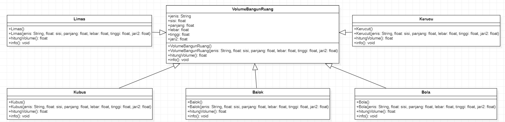

# Laporan Tugas PBO -Pertemuan 7
## Class Diagram
### Hierarchical Inheritance
Pada kasus ini saya menggunakan konsep tentang volume bangun ruang yang dimana superclassnya adalah VolumeBangunRuang yang berisi atribut-atribut dan konstruktor default serta konstruktor berparameter, dan juga method info() 
sedangkan untuk subclassnya saya menggunakan macam-macam bangun ruang yang dimana mewarisi atribut dan method dari superclassnya  

### Hybrid Inheritance
Untuk kasus ini saya menggunakan konsep perkuliahan yang dimana ada sebuah perguruan tinggi, dosen, mahasiswa,mata kuliah, nilai, dan ruangkelas

