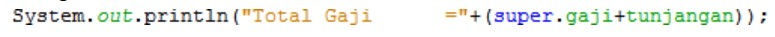
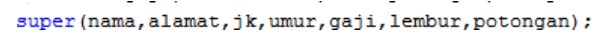
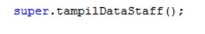
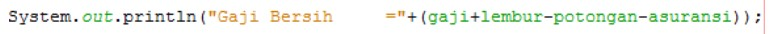

# Laporan Praktikum PBO - Pertemuan 7
## Percobaan 1
### Pertanyaan
1. Sebutkan class mana yang termasuk super class dan sub class dari percobaan 1 diatas!

    **Jawab :**

    Pada percobaan 1 yang merupakan super class adalah class Karyawan dan sub classnya yaitu class Manager dan class Staff. 

2. Kata kunci apakah yang digunakan untuk menurunkan suatu class ke class yang lain?

    **Jawab :**

    Kata kunci ‘extends’

3. Perhatikan kode program pada class Manager, atribut apa saja yang dimiliki oleh class
tersebut? Sebutkan atribut mana saja yang diwarisi dari class Karyawan!

    **Jawab :**

    Atribut yang dimiliki pada class Manager yaitu tunjangan, sedangkan atribut yang diwarisi dari class Karyawan yaitu nama, alamat, jk, umur, gaji.

4. Jelaskan kata kunci super pada potongan program dibawah ini yang terdapat pada class
Manager!

     

    **Jawab :**

    Kata kunci super tersebut digunakan untuk mengakses atau mengambil nilai atribut gaji pada class Karyawan.

5. Program pada percobaan 1 diatas termasuk dalam jenis inheritance apa? Jelaskan
alasannya!

    **Jawab :**

    Percobaan 1 termasuk dalam jenis inheritance karena sebuah class(superclass) memiliki lebih dari 1 class turunan(sub class) atau dengan kata lain lebih dari 1 class turunan memiliki class induk yang sama, contohnya pada kasus ini class Karyawan mewariskan class Manager dan class Staff.

## Percobaan 2
### Pertanyaan
1. Berdasarkan class diatas manakah yang termasuk single inheritance dan mana yang termasuk multilevel inheritance?

    **Jawab :**

    Yang termasuk single inheritance yaitu class Manager sedangkan multiple inheritance yaitu class Staff

2. Perhatikan kode program class StaffTetap dan StaffHarian, atribut apa saja yang dimiliki oleh class tersebut? Sebutkan atribut mana saja yang diwarisi dari class Staff

    **Jawab :**

    Atribut yang dimiliki oleh class StaffTetap yaitu golongan dan asuransi, untuk class StaffHarian memiliki atribut jmlJamKerja. Dan atribut yang diwarisi dari class Staff yaitu lembur, potongan. Dan disini atribut pada class Staff juga diwarisi dari class Karyawan yaitu nama, alamat, jk, umur, gaji, sehingga otomatis juga akan terwariskan ke subclassnya yaitu StaffTetap dan StaffHarian.

3. Apakah fungsi potongan program berikut pada class StaffHarian

     

    **Jawab :**

    Fungsi potongan tersebut yaitu untuk mengakses konstruktor pada super classnya sehingga kita tidak perlu membuat atribut terlebih dahulu untuk mengisikan sebuah nama dsb karena sudah dideklarasikan pada super class nya yaitu class Staff

4. Apakah fungsi potongan program berikut pada class StaffHarian

     

     **Jawab :**

     Fungsi potongan program tersebut yaitu untuk mengakses  dan mengambil nilai method tampil data yang bertipe void pada superclass nya yaitu class Staff.

5. Perhatikan kode program dibawah ini yang terdapat pada class StaffTetap

    

    Terlihat dipotongan program diatas atribut gaji, lembur dan potongan dapat diakses langsung. Kenapa hal ini bisa terjadi dan bagaimana class StaffTetap memiliki atribut gaji, lembur, dan potongan padahal dalam class tersebut tidak dideklarasikan atribut gaji, lembur, dan potongan?

    **Jawab :**

    Atribut gaji, lembur dan potongan dapat diakses langsung karena class StaffHarian adalah sebuah sub class dari class Staff yang dimana class Staff mewarisi sifat class Karyawan yang didalam class Karyawan sudah dideklarasikan atribut tersebut sehingga atribut dapat langsung diakses tidak perlu mendeklarasikannya kembali. Inilah kelebihan dari inheritance yang dimana sebuah atribut maupun method dapat diwariskan sehingga subclassnya tinggal mengaksesnya.