# Laporan Percobaan dan Latihan
## Percobaan 1
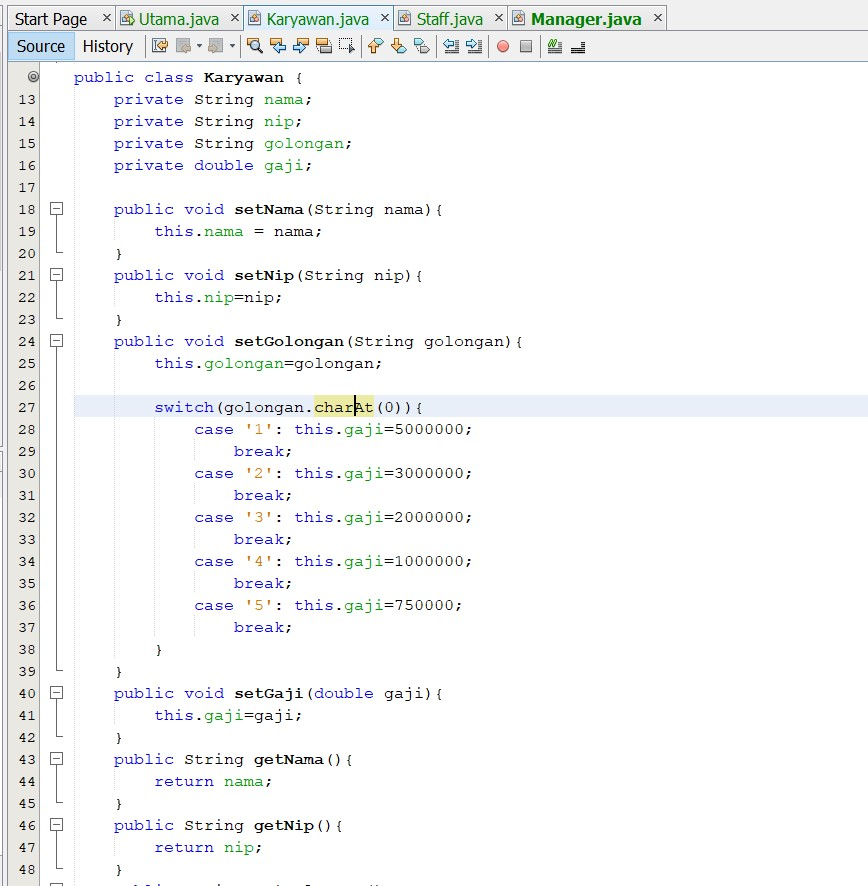

[Kode Program Class Karyawan](../../src/Praktikum9/src/percobaan1/Karyawan.java)

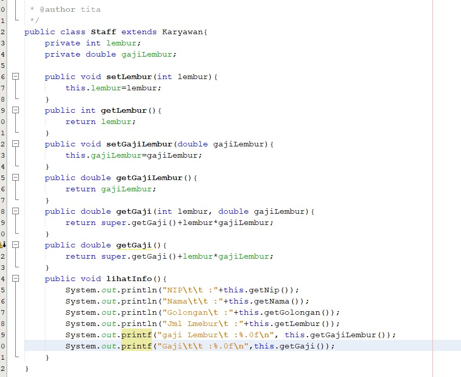

[Kode Program Class Staff](../../src/Praktikum9/src/percobaan1/Staff.java)

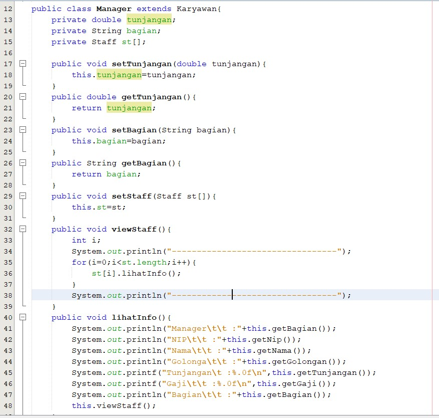

[Kode Program Class Manager](../../src/Praktikum9/src/percobaan1/Manager.java)

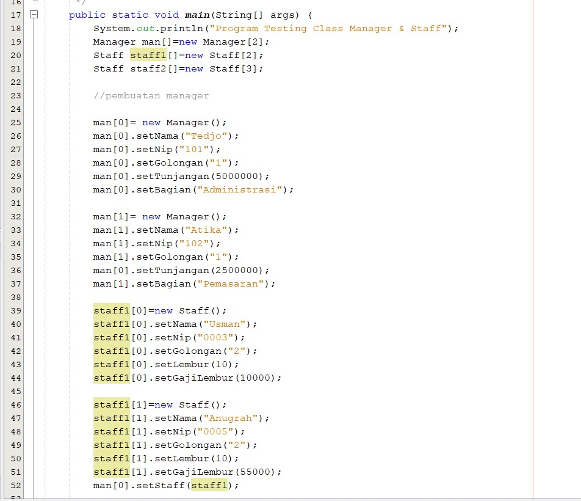

[Kode Program Class Utama](../../src/Praktikum9/src/percobaan1/Utama.java)

Output :

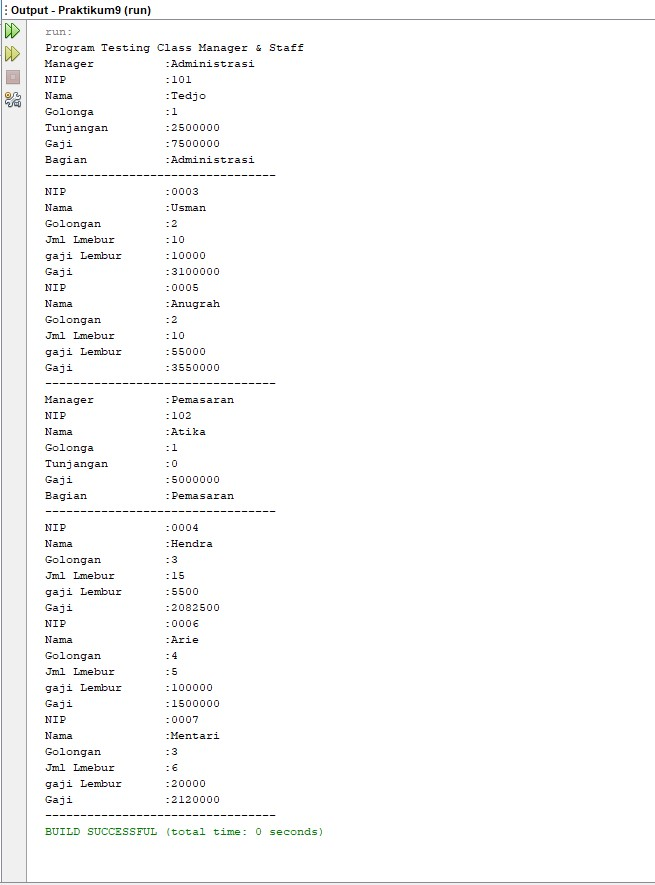

## Latihan
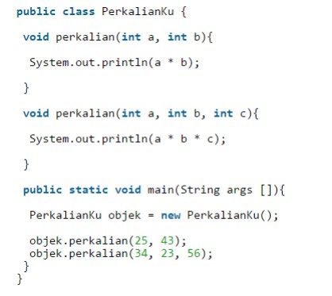

1. Dari source coding diatas terletak dimanakah overloading?

    **Jawab :**

    Method perkalian() yang memiliki 3 paramaeter adalah overloading dari method perkalian() diatasnya yang mempunyai 2 parameter. Berikut adalah gambar dari overloading : 

    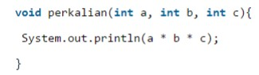

2. Jika terdapat overloading ada berapa jumlah parameter yang berbeda?

    **Jawab :**

    Ada 1 parameter yang berbeda yaitu int c, yang dimana pada method perkalian() memiliki 2 parameter yaitu int a, int b. Kemudian pada overloading ditambahkan parameter int c sehingga terdapat 3 parameter yaitu int a, int b, int c.

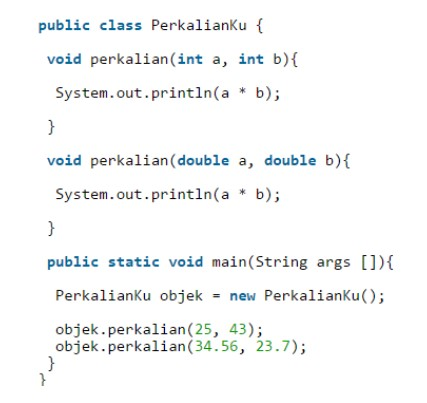

1. Dari source coding diatas terletak dimanakah overloading?

    **Jawab :**

    Overloading terletak pada method perkalian() yang kedua dimana parameter menggunakan tipe double. 

    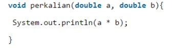

2. Jika terdapat overloading ada berapa tipe parameter yang berbeda?

    **Jawab :**

    Ada 1 tipe parameter yang berbeda yaitu pada overloading menggunakan parameter bertipe double sedangkan pada method perkalian() yang pertama atau yang berada diatasnya menggunakan tipe int. Namun keduanya sama-sama memiliki 2 parameter.

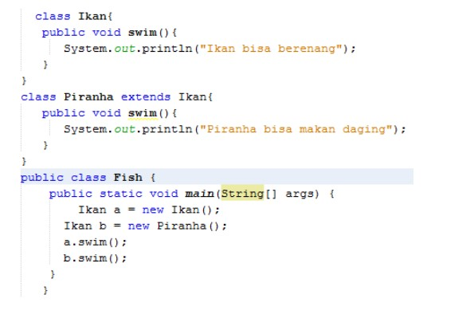

1. Dari source coding diatas terletak dimanakah overriding?

    **Jawab :**

    Overriding terletak pada class Piranha yaitu method swim(), yang dimana method tersebut sama dengan method pada class induknya yaitu Class Ikan sebagai berikut :

    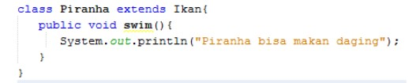

2. Jabarkanlah apabila sourcoding diatas jika terdapat overriding?

    **Jawab :**

    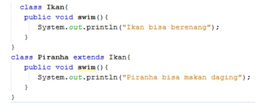

    pada class Ikan terdapat method swim() bertipe void berisi perintah untuk mengeprint kalimat "Ikan bisa berenang", kemudian pada class Piranha yang dimana sebagai subclass dari class Ikan menggunakan method yang namanya sama pada class induknya yaitu method swim() bertipe void namun isinya berbeda yaitu terdapat perintah untuk mengeprint kalimat "Piranha bisa makan daging".