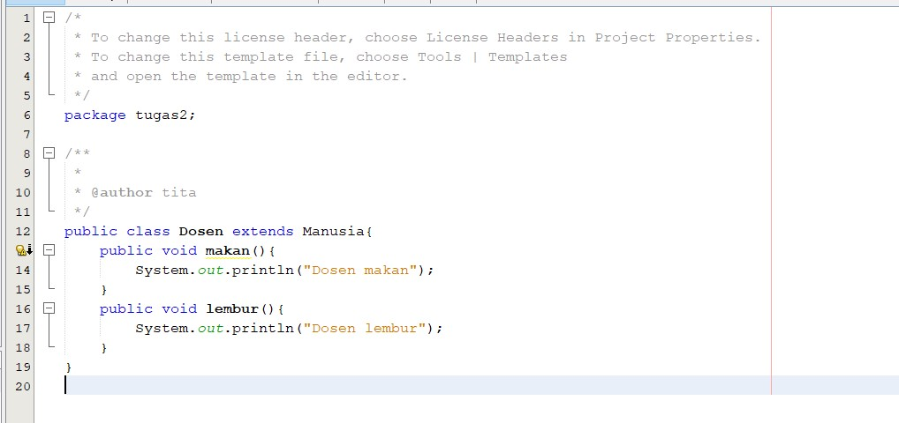

# Laporan Tugas
## Tugas Overloading

[Kode Program Class Segitiga](../../src/Praktikum9/src/tugas1/Segitiga.java)

[Kode Program Class Demo](../../src/Praktikum9/src/tugas1/Demo.java)

output :

## Tugas menggunakan teknik dynamic method dispatch

[Kode Program Class Manusia](../../src/Praktikum9/src/tugas2/Manusia.java)

[Kode Program Class Dosen](../../src/Praktikum9/src/tugas2/Dosen.java)

[Kode Program Class Mahasiswa](../../src/Praktikum9/src/tugas2/Mahasiswa.java)

[Kode Program Class Demo](../../src/Praktikum9/src/tugas2/Demo.java)

Output :

