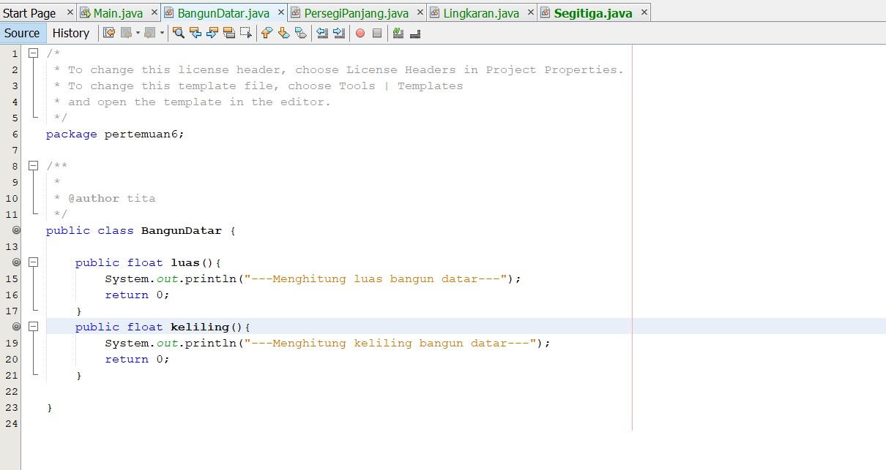
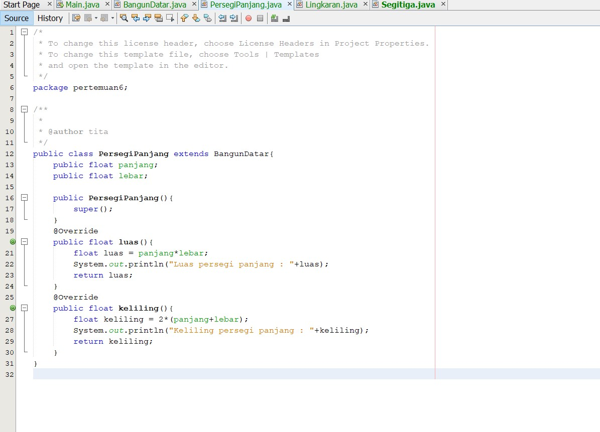
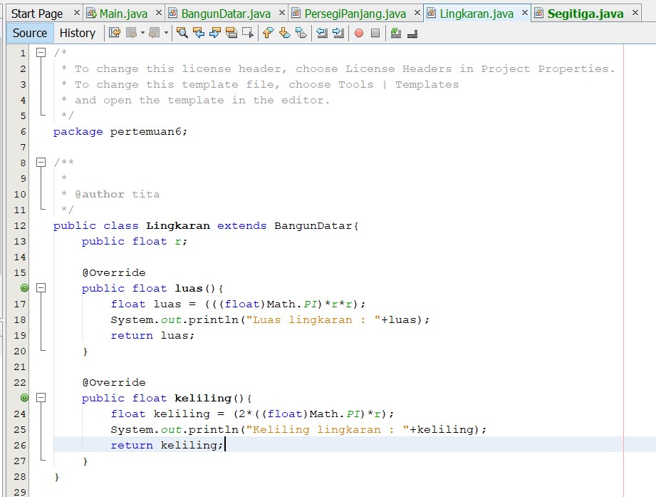
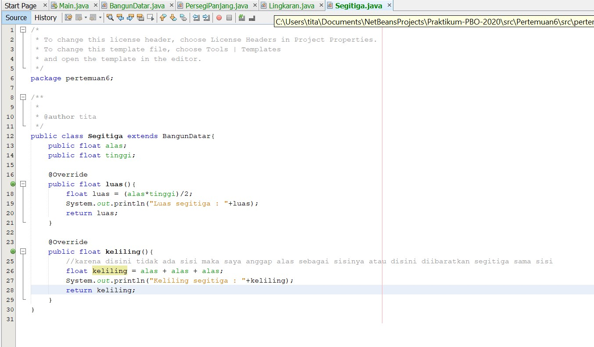
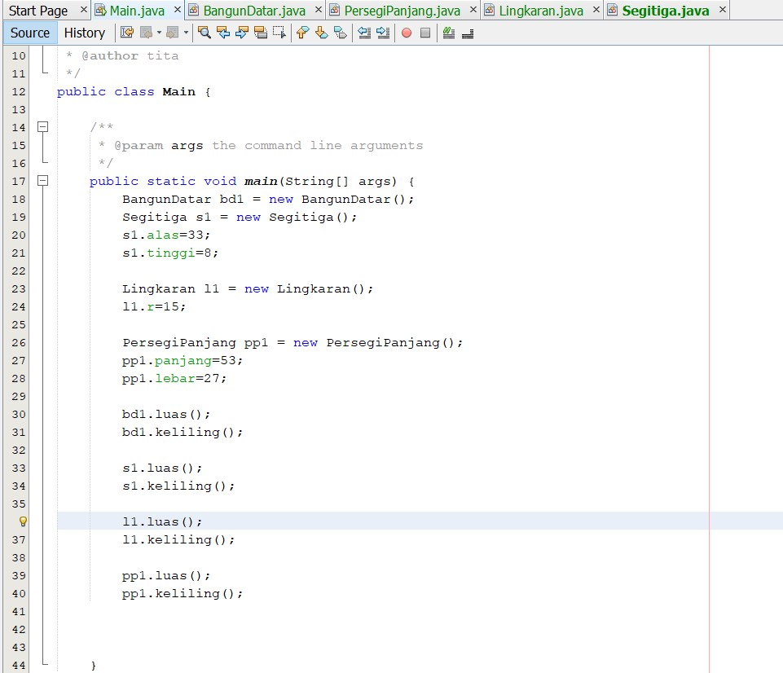
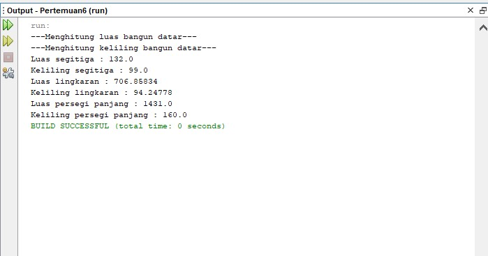

# Laporan Pemrograman Berbasis Objek - Pertemuan 6

[Kode Program Class BangunDatar](../../src/Pertemuan6/src/Inheritance/BangunDatar.java)

[Kode Program Class PersegiPanjang](../../src/Pertemuan6/src/Inheritance/PersegiPanjang.java)

[Kode Program Class Lingkaran](../../src/Pertemuan6/src/Inheritance/Lingkaran.java)

[Kode Program Class Segitiga](../../src/Pertemuan6/src/Inheritance/Segitiga.java)

[Kode Program Class Main](../../src/Pertemuan6/src/Inheritance/Main.java)

Output :

